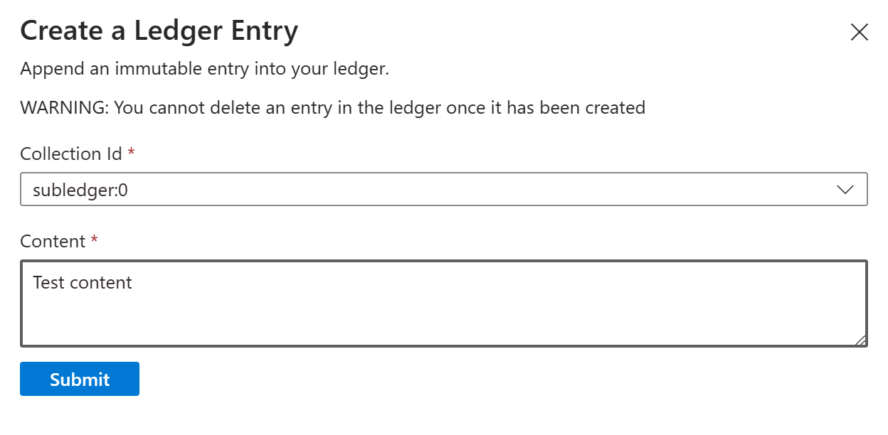
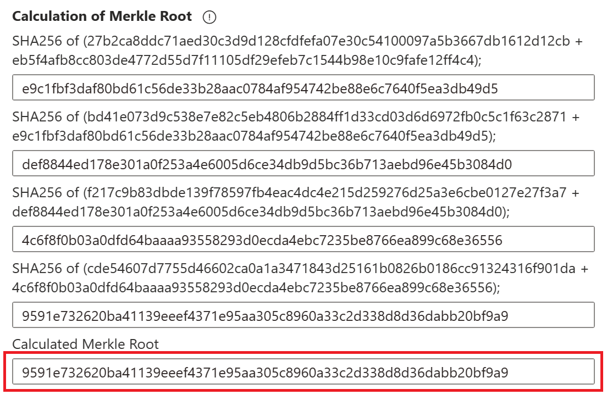

# Quickstart: Upload, view and list ledger data with the Azure ledger explorer

In this quickstart, learn how to use the [Azure portal](https://portal.azure.com) to list, view and verify the integrity and authenticity of the data stored in your Azure confidential ledger. 

## Prerequisites

The ledger explorer is accessible through the Azure Portal for your confidential ledger resource. You need to be logged in with an Entra ID user which has a Reader, Contributor or Administrator role assigned to access the ledger explorer. For help managing Entra ID users for your ledger, please see [Manage Microsoft Entra token-based users in Azure confidential ledger](./manage-azure-ad-token-based-users.md).

## How to use the ledger explorer
The ledger explorer allows you to a list of all transactions on your ledger with their IDs and contents, filtered by collections. You can click on a transaction row to see more details, such as the transaction ID, the transaction receipt, and the cryptographic proof. 

As the ledger is an append-only, sequential datastore, data fetched sequentially starting from Transaction ID `2.1`, the start of the ledger.

To use the ledger explorer, follow these steps:

1) Open the Azure portal and log in as an Entra ID user who has a Reader, Contributor or Administrator role assigned for the confidential ledger resource. 
1) On the Overview page, navigate to the "Ledger explorer (preview)" tab

### Searching for a transaction
[CCF Transaction IDs](https://microsoft.github.io/CCF/main/use_apps/verify_tx.html#verifying-transactions) require both a view and a sequence number, separated by a `.`. e.g. `2.15`

Valid Transaction IDs start at `2.1`. Your transactions will receive a unique sequence number assigned by the system, and will be associated with a view.

If you have previously recorded the specific Transaction ID of a past transaction, you may enter that Transaction ID in the search box to locate that transaction. 

- Search: You can use the filters and the search box to start your transaction search from any Transaction ID.  

### Creating an entry
Entries can be created from ledger explorer if you have Administrator or Contributor roles.  You can use Ledger explorer to quickly create a new ledger entry by clicking on the `Create` button in the command bar. 

Every entry requires a `Collection ID` along with some content. A default Collection ID `subledger:0` is assigned if you do not specify one. 

You can change the Collection ID using the dropdown, or specify a completely new collection by typing it in the `Collection Id` field. 

> [!WARNING]
> Ledger entries are immutable. Once you have committed a transaction you cannot delete it. 
>

## How to verify your ledger data
One of the key features of Azure confidential ledger is that it provides cryptographic evidence that your ledger data has not been tampered with via Transaction Receipts.

A transaction receipt is a JSON document that contains the metadata of a transaction, such as the transaction ID, cryptographic proofs and certificate information. You can use the transaction receipt to verify that a transaction exists on your ledger and that it has not been modified. To learn more about transaction receipts, please read [Write Transaction Receipts](./write-transaction-receipts.md).

Ledger explorer performs the verification steps listed in [Verify Azure Confidential Ledger write transaction receipts](./verify-write-transaction-receipts.md) to verify the transaction receipt.

To begin verifying a transaction:
1. Click on a transaction in Ledger explorer
1. Click on the `Proof` tab. 

### 1. Leaf node computation: 
The transaction digest is computed from the `Claims Digest`, `Commit Evidence` and `Write Set Digest`. This transaction digest is inserted as a leaf node into the merkle tree.

This step corresponds to [Leaf Node Computation](./verify-write-transaction-receipts.md#leaf-node-computation) in [Verify Azure Confidential Ledger write transaction receipts](./verify-write-transaction-receipts.md).

### 2. Root node computation
The transaction receipt provides a cryptographic proof with the Merkle tree branches that leads to the root of the Merkle tree. 

This step corresponds to [Root node Computation](./verify-write-transaction-receipts.md#root-node-computation) in [Verify Azure Confidential Ledger write transaction receipts](./verify-write-transaction-receipts.md)

### 3. Verify signature  
When this transaction is committed, the primary node signs the Merkle root. To verify that this transaction was committed by your ledger and has not been tampered with, Ledger explorer uses the public key of the signing node and the digital signature to verify that the calculated Merkle root matches the signed value. 

Finally, we check that the signing node is endorsed by the ledger. If the transaction is committed and has not been tampered with, Ledger explorer will indicate that the `Globally Committed Status` is `verified`.

This step corresponds to [Verify signature over root node](./verify-write-transaction-receipts.md#verify-signature-over-root-node) and [Verify signing node certificate endorsement](./verify-write-transaction-receipts.md#verify-signing-node-certificate-endorsement) in [Verify Azure Confidential Ledger write transaction receipts](./verify-write-transaction-receipts.md)

## Next steps

Learn more about using the SDK to write to and read from the ledger, and verify write transaction receipts:

- [Quickstart: Microsoft Azure confidential ledger client library for Python](./quickstart-python.md)
- [Verify write transaction receipts - Code Walkthrough](./verify-write-transaction-receipts.md#code-walkthrough)

