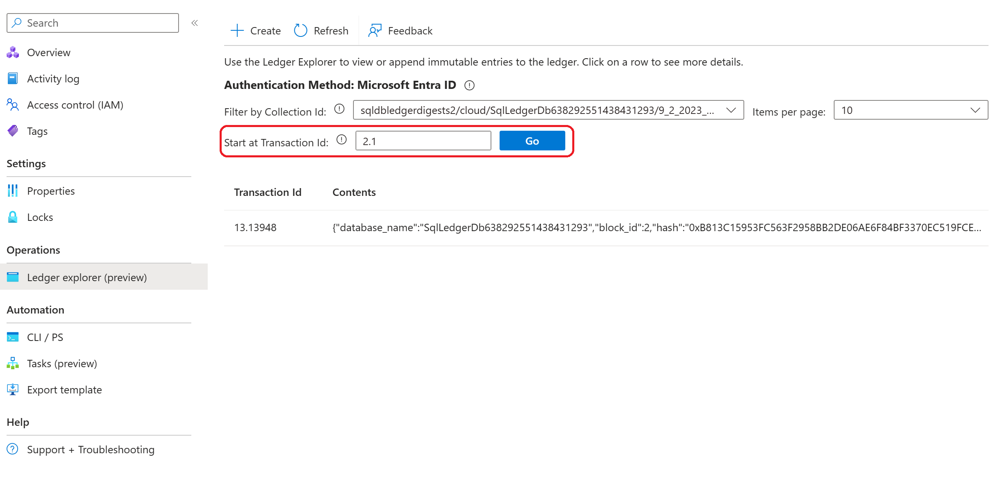

# Quickstart: Upload, view and list ledger data with the Azure ledger explorer

In this quickstart, learn how to use the [Azure portal](https://portal.azure.com) to list, view and verify the integrity and authenticity of the data stored in your Azure confidential ledger. 

## Prerequisites

The ledger explorer is accessible through the Azure Portal for your confidential ledger resource. You need to be logged in with an Entra ID user which has a Reader, Contributor or Administrator role assigned to access the ledger explorer. For help managing Entra ID users for your ledger, please see [Manage Microsoft Entra token-based users in Azure confidential ledger](./manage-azure-ad-token-based-users.md)

## How to use the ledger explorer
To use the ledger explorer, follow these steps:

1) Open the Azure portal and log in as an Entra ID user who has a Reader, Contributor or Administrator role assigned for the confidential ledger resource.
1) On the Overview page, navigate to the "Ledger explorer (preview)" tab

The ledger explorer allows you to a list of all transactions on your ledger with their IDs and contents, filtered by collections. You can click on a transaction row to see more details, such as the transaction ID, the transaction receipt, and the cryptographic proof. 

As the ledger is an append-only, sequential datastore, data fetched sequentially starting from Transaction ID `2.1`, the start of the ledger.

### Searching for a transaction
- Search: You can use the filters and the search box to start your transaction search from any Transaction ID.  

[CCF Transaction IDs](https://microsoft.github.io/CCF/main/use_apps/verify_tx.html#verifying-transactions) require both a view and a sequence number, separated by a `.`. e.g. `2.15`

If you have previously recorded the specific Transaction ID of a past transaction, you may enter that Transaction ID in the search box to jump to that transaction. 

Valid Transaction IDs start at `2.1`. Your transactions will receive a unique sequence number assigned by the system, and will be associated with a view. A v

## How to verify your ledger data
One of the key features of Azure confidential ledger is that it provides cryptographic evidence that your ledger data has not been tampered with. You can use the ledger explorer to verify the integrity and authenticity of your ledger data using the following methods:

Transaction receipts: A transaction receipt is a JSON document that contains the metadata of a transaction, such as the transaction ID, the previous transaction ID, the timestamp, and the content hash. You can use the transaction receipt to verify that a transaction exists on your ledger and that it has not been modified.
Entry receipts: An entry receipt is a JSON document that contains the metadata of an entry, such as the entry ID, the transaction ID, the timestamp, and the content hash. You can use the entry receipt to verify that an entry exists on your ledger and that it has not been modified.
Cryptographic proofs: A cryptographic proof is a JSON document that contains the Merkle tree root hash of your ledger and the Merkle tree branch that leads to a specific transaction or entry. You can use the cryptographic proof to verify that a transaction or entry belongs to your ledger and that it has not been tampered with.
You can access the transaction receipts, the entry receipts, and the cryptographic proofs from the ledger explorer by clicking on the Receipt or Proof buttons on the transaction or entry details pages. You can also download them as JSON files.

To verify your ledger data, you need to use a verification tool that can validate the receipts and the proofs against your ledger. You can use the Azure confidential ledger client library for .NET1 to perform the verification programmatically, or you can use the Azure confidential ledger verification tool, which is a command-line tool that can verify your ledger data offline.