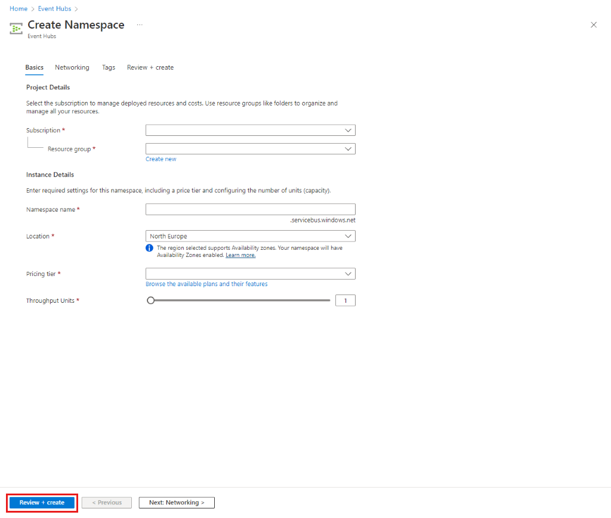
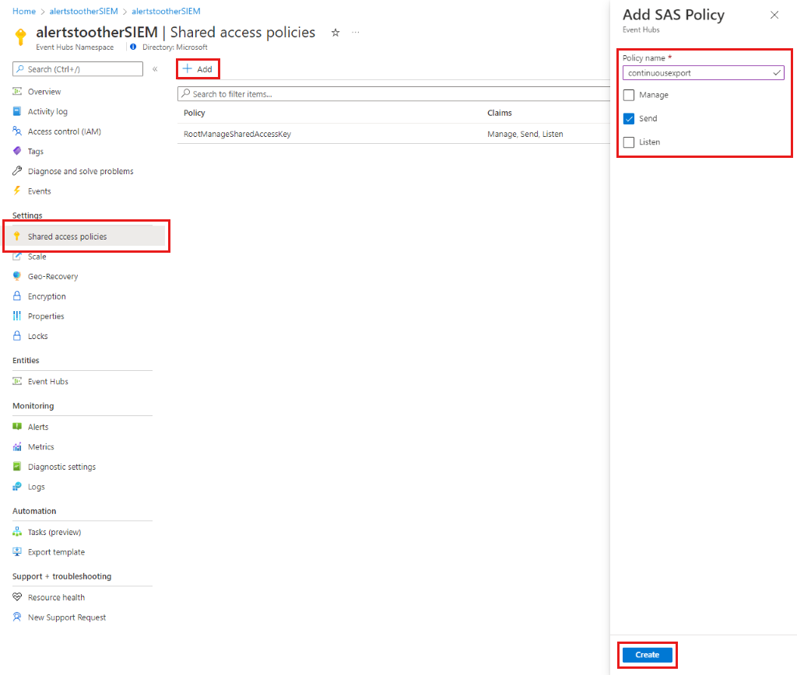
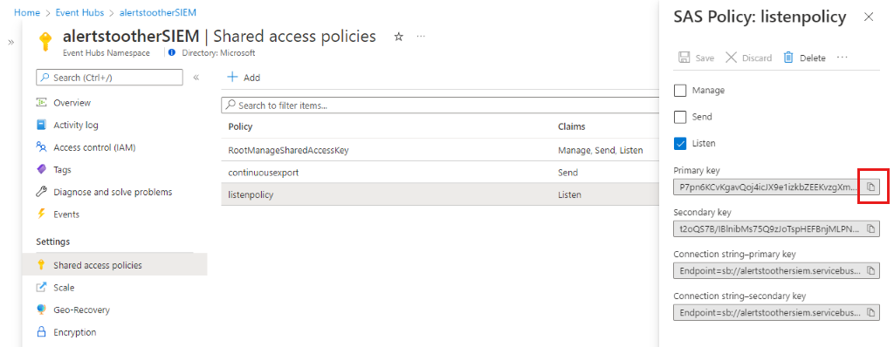

# Stream alerts to QRadar and Splunk

You can In order to stream Microsoft Defender for Cloud security alerts to IBM QRadar and Splunk, you have to set up resources in Event Hubs and Azure Active Directory (Azure AD). Here are the instructions for configuring these resources in the Azure portal, but you can also configure them using [a PowerShell script](export-to-siem.md#stream-alerts-to-qradar-and-splunk).

To configure the Azure resources for QRadar and Splunk in the Azure portal:

1. In the [Event Hubs service](../event-hubs/event-hubs-create.md), create an Event Hubs namespace and event hub.
    
1. Define a policy for the event hub with "Send" permissions:
    1. In the Event Hubs menu, select the Event Hubs namespace you created.
    1. In the namespace menu, select **Shared access policies**.
    1. Click **Add**, enter a unique policy name, and select **Send**.
    1. Click **Create** to create the policy.
        
1. **If you are streaming your alerts to QRadar SIEM** - Create another policy but this time make it a Listen policy.
    1. Click **Add**, enter a unique policy name, and select **Send**.
    1. Click **Create** to create the policy.
    1. After the listen policy is created, copy the **Connection string primary key** and save it to use later.
        
1. Create a consumer group, then copy and save the name to use in the
    SIEM platform.
    1. In the Entities section of the Event Hubs namespace menu, select **Event Hubs** and click on the event hub you created.
        
    1. Click **Consumer group**.
1. Enable continuous export on the Tenant level:
    1. In the Azure search box, search for "policy" and go to the Policy.
    1. In the Policy menu, select **Definitions**.
    1. Search for "deploy export" and select the **Deploy export to Event Hub for Azure Security Center data** built-in policy.
    1. Click **Assign**.
    1. Define the basic policy options:
        1. In Scope, click the **...** to select the level of data to export.
        1. Find your subscription in the Subscription dropdown list, find your resource group in the Resource Group dropdown list, and click **Select**.
            - To select a tenant root management group level you need to have permissions on tenant level.
        1. (Optional) In Exclusions you can define specific subscriptions to exclude from the export.
        1. Enter an assignment name.
        1. Make sure policy enforcement is enabled.
    1. In the policy parameters:
        1. Enter the resource group where the automation resource is saved.
        1. Select resource group location.
        1. Click the **...** next to the **Event Hub details** and enter the details for the event hub, including:
            - Subscription.
            - The Event Hubs namespace you created.
            - The event hub you created.
            - In **authorizationrules**, select the shared access policy that you created to send alerts.
    1. Click **Review and Create** and **Create** to finish the process of defining the continuous export to Event Hubs.
        - Notice that when you activate continuous export policy on tenant root management group level, it automatically streams your alerts on any **new** subscription that will be created under this tenant.
1. **If you are streaming your alerts to QRadar SIEM** - Create a storage account, then copy and save the connection string to the account to use in QRadar.
    1. Go to the Azure portal, click **Create a resource**, and select **Storage account**. If that option is not shown, search for "storage account".
    1. Click **Create**.
    1. Enter the details for the storage account, click **Review and Create**, and then **Create**.
    1. After you create your storage account and go to the resource, in the menu select **Access Keys**.
    1. Select **Show keys** to see the keys, and copy the connection string of Key 1.
1. **If you are streaming your alerts to Splunk SIEM -** Create an Azure AD application.
    1. In the menu search box, search for "Azure Active Directory" and go to Azure Active Directory.
    1. Go to the Azure portal, click **Create a resource**, and select **Azure Active Directory**. If that option is not shown, search for "active directory".
    1. In the menu, select **App registrations**.
    1. Click **New registration**.
    1. Enter a unique name for the application and click **Register**.
    1. Copy to Clipboard and save the **Application (client) ID** and **Directory (tenant) ID**.
    1. In the menu, go to **Certificates & secrets**.
    1. Create a password for the application to prove its identity when requesting a token:
        1. Select **New client secret**.
        1. Enter a short description, choose the expiration time of the secret, and click **Add**.
        1. After the secret is created, copy the Secret ID and save it for later use together with the Application ID and Directory (tenant) ID.
1. **If you are streaming your alerts to Splunk SIEM -** Give permissions to the Azure AD Application to read from the event hub you created before.
    1. Go to the Event Hubs namespace you created.
    1. In the menu, go to **Access control**.
    1. Click **Add** and select **Add role assignment**.
    1. Click **Add role assignment**.
    1. In the Roles tab, search for **Azure Event Hubs Data Receiver**.
    1. Click **Next**.
    1. Click **Select Members**.
    1. Search for the Azure AD application you created before and select it.
    1. Click **Close**.

Now you can [install the built-in connectors](export-to-siem.md#Step 2. Connect the event hub to your preferred solution using the built-in connectors) for the SIEM you are using.