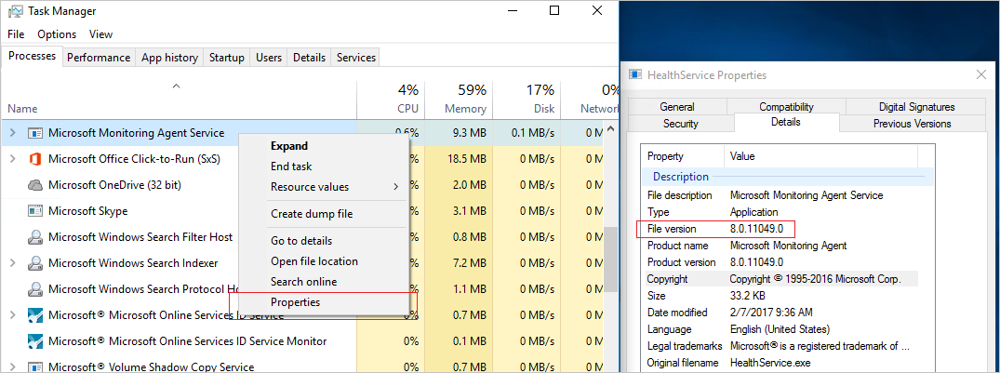
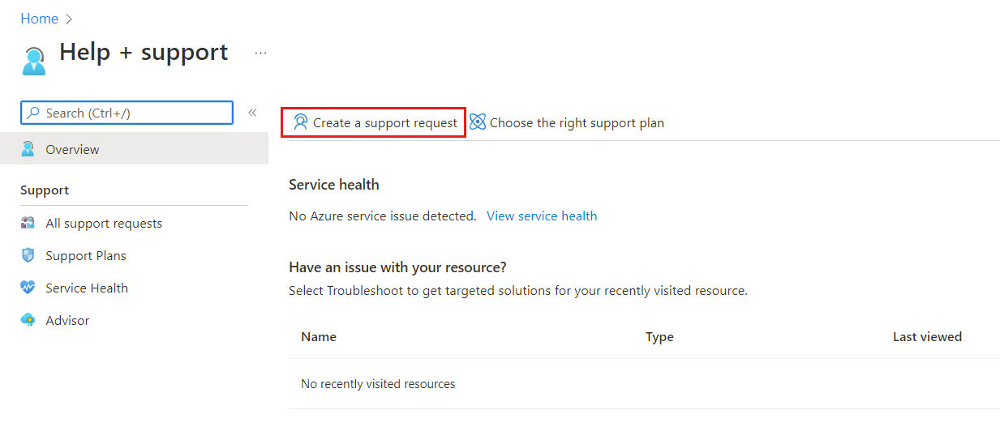

# Microsoft Defender for Cloud Troubleshooting Guide

[!INCLUDE [Banner for top of topics](./includes/banner.md)]

This guide is for information technology (IT) professionals, information security analysts, and cloud administrators whose organizations need to troubleshoot Defender for Cloud related issues.

Defender for Cloud uses the Log Analytics agent to collect and store data. See [Microsoft Defender for Cloud Platform Migration](./enable-data-collection.md) to learn more. The information in this article represents Defender for Cloud functionality after transition to the Log Analytics agent.

> [!TIP]
> A dedicated area of the Defender for Cloud pages in the Azure portal provides a collated, ever-growing set of self-help materials for solving common challenges with Defender for Cloud.
>
> When you're facing an issue, or are seeking advice from our support team, **Diagnose and solve problems** is good place to look for solutions:
>
> :::image type="content" source="media/release-notes/solve-problems.png" alt-text="Defender for Cloud's 'Diagnose and solve problems' page":::

## Troubleshooting guide

This guide explains how to troubleshoot Defender for Cloud related issues.

Alert types:

- Virtual Machine Behavioral Analysis (VMBA)
- Network Analysis
- SQL Database and Azure Synapse Analytics Analysis
- Contextual Information

Depending on the alert types, customers can gather the necessary information to investigate the alert by using the following resources:

- Security logs in the Virtual Machine (VM) event viewer in Windows
- AuditD in Linux
- The Azure activity logs, and the enable diagnostic logs on the attack resource.

Customers can share feedback for the alert description and relevance. Navigate to the alert itself, select the **Was This Useful** button, select the reason, and then enter a comment to explain which explains the feedback. We consistently monitor this feedback channel to improve our alerts.

## Audit log

Most of the troubleshooting done in Defender for Cloud takes place by first looking at the [Audit Log](../azure-monitor/essentials/platform-logs-overview.md) records for the failed component. Through audit logs, you can determine:

- Which operations were taken place
- Who initiated the operation
- When the operation occurred
- The status of the operation
- The values of other properties that might help you research the operation

The audit log contains all write operations (PUT, POST, DELETE) performed on your resources, however it does not include read operations (GET).

## Log Analytics agent

Defender for Cloud uses the Log Analytics agent – this is the same agent used by the Azure Monitor service – to collect security data from your Azure virtual machines. After data collection is enabled and the agent is correctly installed in the target machine, the process below should be in execution:

- HealthService.exe

If you open the services management console (services.msc), you will also see the Log Analytics agent service running as shown below:

To see which version of the agent you have, open **Task Manager**, in the **Processes** tab locate the **Log Analytics agent Service**, right-click on it and click **Properties**. In the **Details** tab, look the file version as shown below:

## Log Analytics agent installation scenarios

There are two installation scenarios that can produce different results when installing the Log Analytics agent on your computer. The supported scenarios are:

- **Agent installed automatically by Defender for Cloud**: in this scenario you will be able to view the alerts in both locations, Defender for Cloud and Log search. You will receive email notifications to the email address that was configured in the security policy for the subscription the resource belongs to.

- **Agent manually installed on a VM located in Azure**: in this scenario, if you are using agents downloaded and installed manually prior to February 2017, you can view the alerts in the Defender for Cloud portal only if you filter on the subscription the workspace belongs to. If you filter on the subscription the resource belongs to, you won't see any alerts. You'll receive email notifications to the email address that was configured in the security policy for the subscription the workspace belongs to.

> [!NOTE]
> To avoid the behavior explained in the second scenario, make sure you download the latest version of the agent.

## Troubleshooting monitoring agent network requirements

For agents to connect to and register with Defender for Cloud, they must have access to network resources, including the port numbers and domain URLs.

- For proxy servers, you need to ensure that the appropriate proxy server resources are configured in agent settings. Read this article for more information on [how to change the proxy settings](../azure-monitor/agents/agent-windows.md).
- For firewalls that restrict access to the Internet, you need to configure your firewall to permit access to Log Analytics. No action is needed in agent settings.

The following table shows resources needed for communication.

| Agent Resource | Ports | Bypass HTTPS inspection |
|---|---|---|
| *.ods.opinsights.azure.com | 443 | Yes |
| *.oms.opinsights.azure.com | 443 | Yes |
| *.blob.core.windows.net | 443 | Yes |
| *.azure-automation.net | 443 | Yes |

If you encounter onboarding issues with the agent, make sure to read the article [How to troubleshoot Operations Management Suite onboarding issues](https://support.microsoft.com/help/3126513/how-to-troubleshoot-operations-management-suite-onboarding-issues).

## Troubleshooting endpoint protection not working properly

The guest agent is the parent process of everything the [Microsoft Antimalware](../security/fundamentals/antimalware.md) extension does. When the guest agent process fails, the Microsoft Antimalware that runs as a child process of the guest agent may also fail.  In scenarios like that is recommended to verify the following options:

- If the target VM is a custom image and the creator of the VM never installed guest agent.
- If the target is a Linux VM instead of a Windows VM then installing the Windows version of the antimalware extension on a Linux VM will fail. The Linux guest agent has specific requirements in terms of OS version and required packages, and if those requirements are not met the VM agent will not work there either.
- If the VM was created with an old version of guest agent. If it was, you should be aware that some old agents could not auto-update itself to the newer version and this could lead to this problem. Always use the latest version of guest agent if creating your own images.
- Some third-party administration software may disable the guest agent, or block access to certain file locations. If you have third-party installed on your VM, make sure that the agent is on the exclusion list.
- Certain firewall settings or Network Security Group (NSG) may block network traffic to and from guest agent.
- Certain Access Control List (ACL) may prevent disk access.
- Lack of disk space can block the guest agent from functioning properly.

By default the Microsoft Antimalware User Interface is disabled, read [Enabling Microsoft Antimalware User Interface on Azure Resource Manager VMs Post Deployment](/archive/blogs/azuresecurity/enabling-microsoft-antimalware-user-interface-post-deployment) for more information on how to enable it if you need.

## Troubleshooting problems loading the dashboard

If you experience issues loading the workload protection dashboard, ensure that the user that registers the subscription to Defender for Cloud (i.e. the first user one who opened Defender for Cloud with the subscription) and the user who would like to turn on data collection should be *Owner* or *Contributor* on the subscription. From that moment on also users with *Reader* on the subscription can see the dashboard/alerts/recommendation/policy.

## Contacting Microsoft Support

Some issues can be identified using the guidelines provided in this article, others you can also find documented at the Defender for Cloud public [Microsoft Q&A page](/answers/topics/azure-security-center.html). However if you need further troubleshooting, you can open a new support request using **Azure portal** as shown below:

## See also

In this page, you learned how to configure security policies in Microsoft Defender for Cloud. To learn more about Microsoft Defender for Cloud, see the following:

- [Managing and responding to security alerts in Microsoft Defender for Cloud](managing-and-responding-alerts.md) — Learn how to manage and respond to security alerts
- [Alerts Validation in Microsoft Defender for Cloud](alert-validation.md)
- [Microsoft Defender for Cloud FAQ](faq-general.yml) — Find frequently asked questions about using the service
