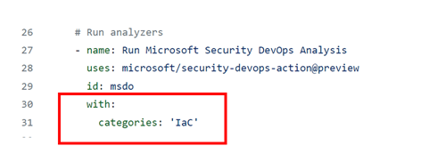

## Tutorial: Discover vulnerabilities in Infrastructure as Code (IaC)

After setting up the Microsoft Security DevOps Extension or Workflow, there is support in the YAML configuration to run several of the tools, or a single tool. For instance, if you are only interested in Infrastructure as Code scanning, this tutorial guides you through setting up only IaC scanning.

### Steps: GitHub 

*Prerequisite: see* [Microsoft Security DevOps GitHub action](#MSDO_GHaction) *to setup and configure the Microsoft Security DevOps GitHub Action*

1.  From the Repository home page, click **.github/workflows folder**

2.  Click on the **workflow .yml** that you setup in the prerequisite steps

3.  Edit the workflow: in the "Run Analyzers" section add the following:

4.  Save the workflow by clicking **Start Commit-\>Commit changes**

5.  (Skip this step if you already have an Infrastructure as Code template in your repository.)

     If you need an IaC template, download a basic web app template from the Azure QuickStarts [here](https://github.com/Azure/azure-quickstart-templates/tree/master/quickstarts/microsoft.web/webapp-basic-linux)

6.  Upload the template to your repository and commit the template to your repository

7.  Click on **Actions** and you should see a workflow running with the template committed in step 6

8.  Click in the workflow to see the results

9.  Scroll through the results and you will see the scan results. It should look like the following

10. Click on the **Security** tab and then click on **Code scanning alerts** to see the results in the GitHub Code scanning interface

### Steps: Azure DevOps 

*Prerequisite: see* [Microsoft Security DevOps Azure DevOps extension](#MSDO_ADOextension) *to setup and configure the Microsoft Security DevOps the Extension*

1.  From the Pipeline, locate the pipeline with the MSDO Azure DevOps Extension configured

2.  Edit the pipeline

3.  Add the following lines to the YAML file

4.  Click **Save**

5.  Click **Save** to commit directly to the main branch or Create a new branch for this commit

6.  Click on the pipeline to view the results of the IaC scan and click on any result to see the details

### Summary

In this tutorial you learned how to configure the Microsoft Security DevOps GitHub Action and Azure DevOps Extension to scan for only Infrastructure as Code vulnerabilities.