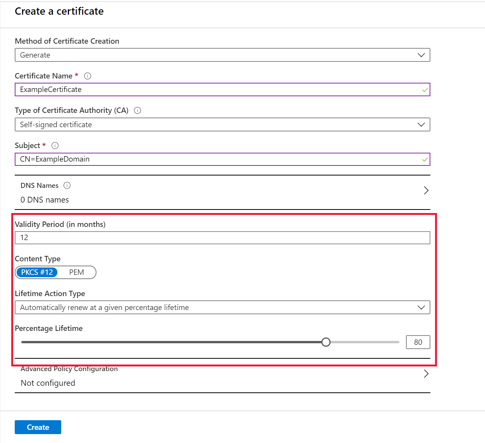

# Tutorial: Configuring certificate's auto-rotation in Key Vault

Azure Key Vault lets you easily provision, manage, and deploy digital certificates. They could be public and private SSL/TLS certificates signed by Certificate Authority or a self-signed certificate. Key Vault can also request and renew certificates through partnerships with certificate authorities, providing a robust solution for certificate life cycle management. In this tutorial, you will update certificate's attributes - validity period, auto-rotation frequency, CA. For more information on Key Vault, review the [Overview](../general/overview.md).

The tutorial shows you how to:

> [!div class="checklist"]
> * Manage a certificate using Azure portal
> * Add Certificate Authority provider Account
> * Update certificate's validity period
> * Update certificate's auto-rotation frequency
> * Update certificate's attributes using Azure Powershell


Before you begin, read [Key Vault basic concepts](../general/basic-concepts.md). 

If you don't have an Azure subscription, create a [free account](https://azure.microsoft.com/free/?WT.mc_id=A261C142F) before you begin.

## Sign in to Azure

Sign in to the Azure portal at https://portal.azure.com.

## Create a vault

Create or select your existing Key Vault to  perform operations. [(Steps to create a Key vault).](../quick-create-portal.md) In the example, the Vault name is **Example-Vault**. 


## Create a certificate in Key Vault

Create or import a certificate in the vault. [(Steps to create certificate in Key vault).](../quick-create-portal.md) In this case, we work on certificate called **ExampleCertificate**.

> [!NOTE]
> In Azure Key Vault, a certificate's life cycle attributes can be updated both at the time of certificate's creation as well as after it has been created. 
## Updating Certificate's life cycle attributes

A certificate created in the Key Vault can be 
- a self-signed certificate
- a certificate created with a Certificate Authority (CA) that is partnered with Key Vault
- a certificate with a Certificate Authority that is not partnered with Key Vault

The following Certificate Authorities are currently partnered providers with Key Vault:
- DigiCert - Key Vault offers OV TLS/SSL certificates with DigiCert.
- GlobalSign - Key Vault offers OV TLS/SSL certificates with GlobalSign.

Azure Key Vault auto-rotates certificates through partnerships with certificate authorities. Through that established partnership, Key Vault automatically requests and renews certificates. Therefore, **auto-rotation capability is not applicable for certificates created with CAs that are not partnered with Key Vault.** 

> [!NOTE]
> An account admin for a CA provider creates credentials to be used by Key Vault to create, renew, and use TLS/SSL certificates via Key Vault.

> 


### Updating Certificate's life cycle attributes at the time of Certificate creation

1. On the Key Vault properties pages, select **Certificates**.
2. Click on **Generate/Import**.
3. On the **Create a certificate** screen update the following values:
    

    - **Validity Period**: Enter the value (in  months). Creating short lived certificates is a recommended security practice. By default validity value of a newly created certificate is 12 months.
    - **Lifetime Action Type**: Select certificate's auto-renewal and alerting action. As per the selection, update 'percentage lifetime' or 'Number of days before expiry'. By default, a certificate's auto-renewal is set at 80% of its lifetime.<br> From the drop down menu, select the option :

    |  Automatically renew at a given time| Email all contacts at a given time |
    |-----------|------|
    |Selecting this option will TURN ON autorotation | Selecting this option will NOT auto-rotate, it will only alert the contacts|
        


4. Click on **Create**.



### Updating Life cycle attributes of stored certificate

1. Select the Key Vault.
2. On the Key Vault properties pages, select **Certificates**.
3. Select the certificate that you wish to update. In this case, we will work on certificate called **ExampleCertificate**.
4. Select **Issuance Policy** from the top menu bar.


5. On the **Issuance Policy** screen, update the following values:
- **Validity Period**: Update the value (in  months)
- **Lifetime Action Type**: Select certificate's auto-renewal and alerting action. As per the selection, update the 'percentage lifetime' or 'Number of days before expiry'. 


6. Click on **Save**.

> [!IMPORTANT]
> Changing the Lifetime Action Type for a certificate will record modifications for the existing certificates immediately.


### Updating Certificate's attributes using PowerShell

```azurepowershell


Set-AzureKeyVaultCertificatePolicy -VaultName $vaultName 
                                   -Name $certificateName 
                                   -RenewAtNumberOfDaysBeforeExpiry [276 or appropriate calculated value]
```

> [!TIP]
> To modify renewal policy for a list of certificates, input​ File.csv​ containing
>  VaultName,CertName ​<br/>
>  vault1,Cert1​ <br/>
>  vault2,Cert2​
>
>  ```azurepowershell
>  $file = Import-CSV C:\Users\myfolder\ReadCSVUsingPowershell\File.csv ​
> foreach($line in $file)​
> {​
> Set-AzureKeyVaultCertificatePolicy -VaultName $vaultName -Name $certificateName -RenewAtNumberOfDaysBeforeExpiry [276 or appropriate calculated value]
> }
>  ```
> 
Learn more about the parameters [here](https://docs.microsoft.com/cli/azure/keyvault/certificate?view=azure-cli-latest#az-keyvault-certificate-set-attributes)

## Clean up resources

Other Key Vault quickstarts and tutorials build upon this quickstart. If you plan to continue on to work with subsequent quickstarts and tutorials, you may wish to leave these resources in place.
When no longer needed, delete the resource group, which deletes the Key Vault and related resources. To delete the resource group through the portal:

1. Enter the name of your resource group in the Search box at the top of the portal. When you see the resource group used in this quickstart in the search results, select it.
2. Select **Delete resource group**.
3. In the **TYPE THE RESOURCE GROUP NAME:** box type in the name of the resource group and select **Delete**.


## Next steps

In this tutorial, you updated a certificate's life-cycle. To learn more about Key Vault and how to integrate it with your applications, continue on to the articles below.

Read more about [Managing certificate creation in Azure Key Vault](../articles/key-vault/certificates/create-certificate-scenarios.md)
- Review the [Key Vault Overview](../general/overview.md)