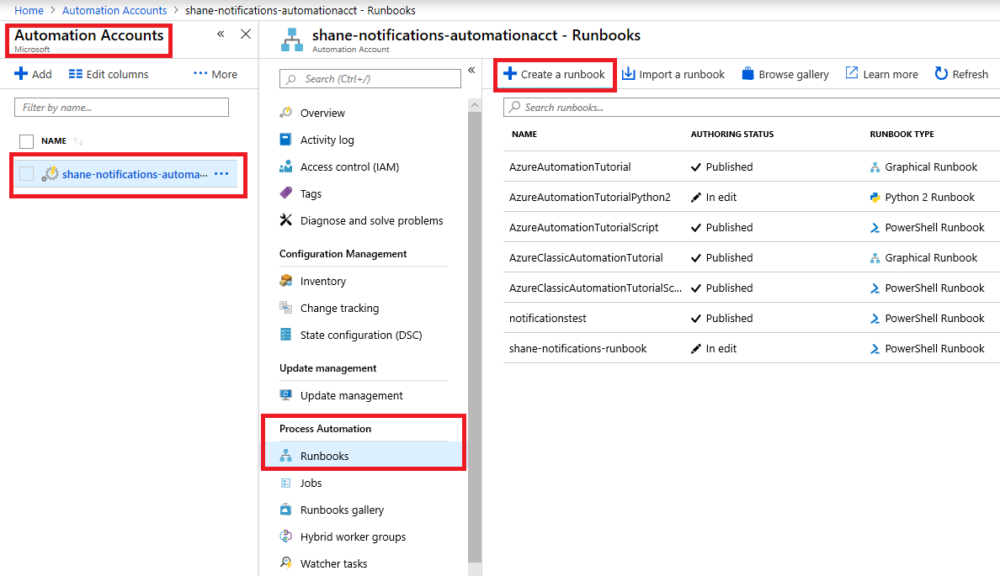
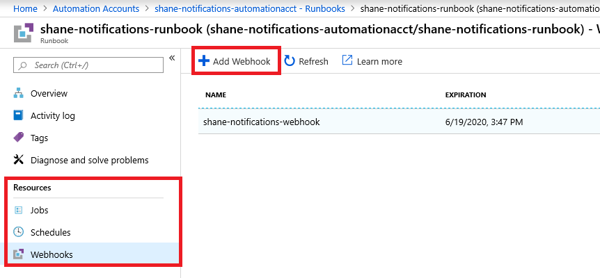
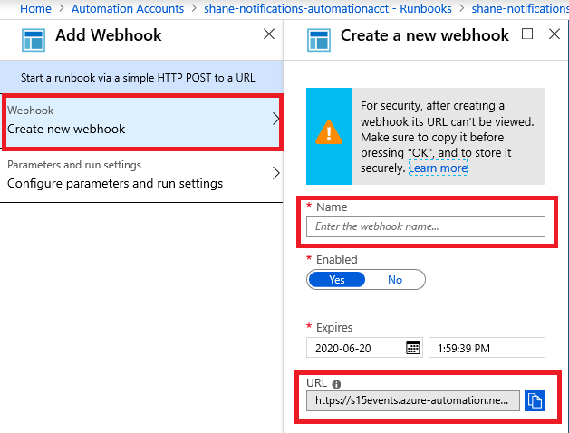
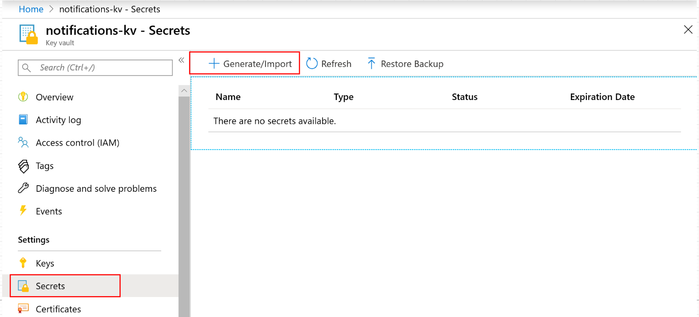

# How to: Route Key Vault Events to Automation Runbook (preview)

Key Vault integration with Azure Event Grid, currently in preview, enables users to be notified when the status of a secret stored in key vault has changed. For an overview of the feature, see [Monitoring Key Vault with Azure Event Grid](event-grid-overview.md).

This guide will show you how to receive Key Vault notifications through Azure Event Grid, and how to respond to status changes with Azure Automation.

## Prerequisites

- An Azure Subscription. If you don't have an Azure subscription, create a [free account](https://azure.microsoft.com/free/?WT.mc_id=A261C142F) before you begin.
- A key vault in your Azure Subscription. You can quickly create a new key vault by following the steps in [Set and retrieve a secret from Azure Key Vault using Azure CLI](quick-create-cli.md)

## Concepts

Azure Event Grid is an eventing service for the cloud. In this guide, you will subscribe to events for key vault and route events to Azure Automation. When one of the secrets in the key vault is about to expire, Event Grid is notified of the status change and makes an HTTP POST to the endpoint. A web hook then triggers a Azure Automation execution of PowerShell script.


## Create an Azure Automation account

Create an Azure Automation account through the [Azure portal](http://portal.azure.com).

1.  Go to portal.azure.com and log in to your subscription.

1.  In the search box, type in "Automation Accounts".

1.  Under the "Services" Section of the drop-down from the search bar, select "Automation Accounts".

1.  Click Add.

    

1.  Fill the required information in the "Add Automation Account" Blade and select "Create".

## Create a Runbook

After your Azure Automation account is ready, create a runbook.



1.  Select the automation account you created in step 1.

1.  Select "Runbooks" under the Process Automation section.

1.  Click the "Create a runbook".

1.  Name your runbook and select "PowerShell" as the runbook type.

1.  Click on the runbook you created, and select the "Edit" Button.

1.  Enter the following code (for testing purposes) and click the "Publish" button. This will output the result of the POST request received.

```azurepowershell
param
(
[Parameter (Mandatory = $false)]
[object] $WebhookData
)

#If runbook was called from Webhook, WebhookData will not be null.
if ($WebhookData) {

#rotate secret:
#generate new secret version in key vault
#update db/service with generated secret

#Write-Output "WebhookData <$WebhookData>"
Write-Output $WebhookData.RequestBody
}
else
{
# Error
write-Error "No input data found." 
}
```


## Create a webhook

Now create a webhook, to trigger your newly created runbook.

1.  Select "Webhooks" from the resources section of the runbook you just published.

1.  Click "Add Webhook".

    

1.  Select "Create new Webhook".

1. Name the webhook, set an expiration date, and **copy the URL**.

    > [!IMPORTANT] 
    > You cannot view the URL after you create it. Make sure you save a copy a secure location where you can access it for the remainder of this guide.

1. Click "Parameters and run settings", and select "OK". Do not enter any parameters. This will enable the "Create" button.

1. Select "OK", and select "Create".

    

## Create an Event Grid subscription

Create an Event Grid subscription through the [Azure portal](http://portal.azure.com).

1.  Open the Azure Portal using the following link: https://ms.portal.azure.com/?Microsoft_Azure_KeyVault_ShowEvents=true&Microsoft_Azure_EventGrid_publisherPreview=true

1.  Go to your key vault and select the "Events" tab. If you cannot see the Events tab, make sure that you are using the [preview version of the portal](https://ms.portal.azure.com/?Microsoft_Azure_KeyVault_ShowEvents=true&Microsoft_Azure_EventGrid_publisherPreview=true).

    

1.  Click the "+ Event Subscription" button.

1.  Create a descriptive name for the subscription.

1.  Choose "Event Grid Schema".

1.  "Topic Resource" should be the key vault you want to monitor for status changes.

1.  For "Filter to Event Types", leave all checked ("9 selected").

1.  For "Endpoint Type", select "Webhook".

1.  Select "Select an endpoint". In the new context pane, paste the webhook URL from the [Create a webhook](#create-a-webhook) step into the "Subscriber Endpoint" field.

1.  Select "Confirm Selection" on the context pane.

1.  Select "Create".

    

## Test and verify

Verify that your Event Grid subscription is property configured.  This test assumes that you have subscribed to "Secret New Version Created" notification in the [Create an Event Grid subscription](#create-an-event-grid-subscription), and that you have the necessary privileges to create a new version of a secret in a key vault.




1.  Go to your key vault on the Azure Portal

1.  Create a new secret. For testing purposes, set expiration to date to next day.

1.  Navigate to the events tab in your key vault.

1.  Select the event grid subscription you created.

1.  Under metrics, see if an event was captured. Two events are expected : SecretNewVersion and SecretNearExpiry. This validates that event grid successfully captured the status change of the secret in your key vault.

    

1.  Go to your Azure Automation account.

1.  Select the "Runbooks" tab, and select the runbook you created.

1.  Select the "Webhooks" tab, and confirm that the "last triggered" timestamp is within 60 second of when you created the new secret.  This confirms that Event Grid made a POST to the webhook with the event details of the status change in your key vault, and the webhook was triggered.

    

1. Return to your Runbook and select the "Overview" Tab.

1. Look at the Recent Jobs list. You should see that a job was created and that the status is complete.  This confirms that the webhook triggered the runbook to start executing its script.

    

1. Select the recent job and look at the POST request that was sent from event grid to the webhook. Examine the JSON and make sure that the parameters for your key vault and event type are correct. If the "event type" parameter in the JSON object matches the event which occurred in the key vault (in this example, Microsoft.KeyVault.SecretNearExpiry) the test was successful.

    

## Troubleshooting

### Unable to create event subscription

Reregister Event Grid and Key Vault provider in your azure subscription resource providers. See [Azure resource providers and types](../azure-resource-manager/resource-manager-supported-services.md).

## Next steps

Congratulations! If you have followed all the steps above, you are now ready to programmatically respond to status changes of secrets stored in your key vault.

If have been using a polling-based system to look for status changes of secrets in your key vaults, migrate to using this notification feature. You can also replace the test script in your runbook with code to programmatically renew your secrets when they are about to expire.

Learn more:

- [Azure Key Vault overview](key-vault-overview.md)
- [Azure Event Grid overview](../event-grid/overview.md)
- [Monitoring Key Vault with Azure Event Grid (preview)](event-grid-overview.md)
- [Azure Event Grid event schema for Azure Key Vault (preview)](../event-grid/event-schema-key-vault.md)
- [Azure Automation overview](../automation/index.yml)