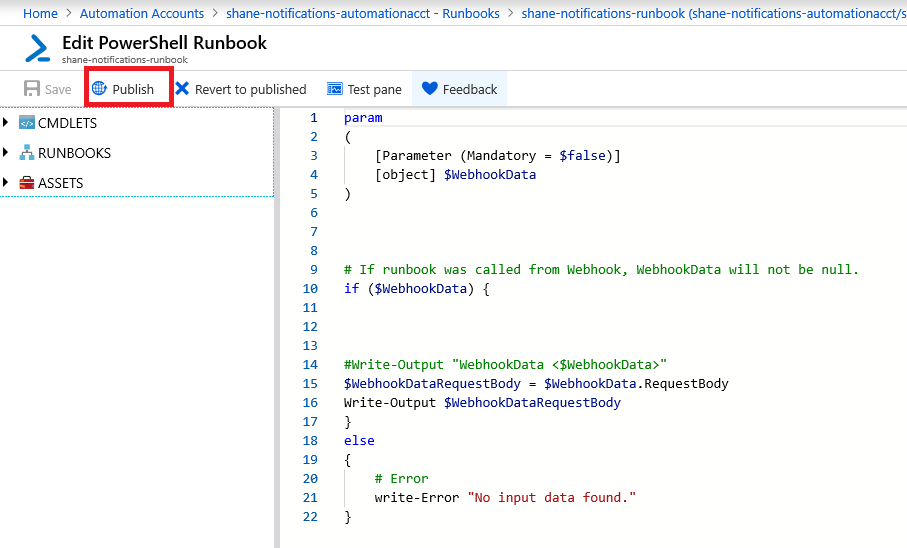
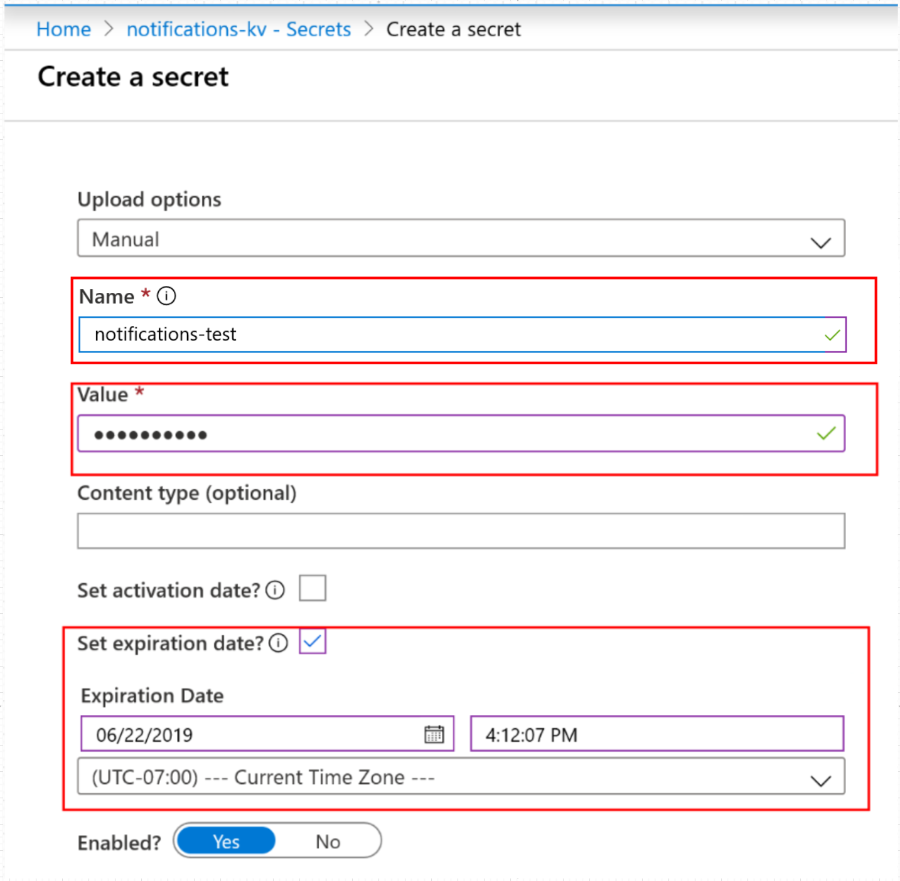
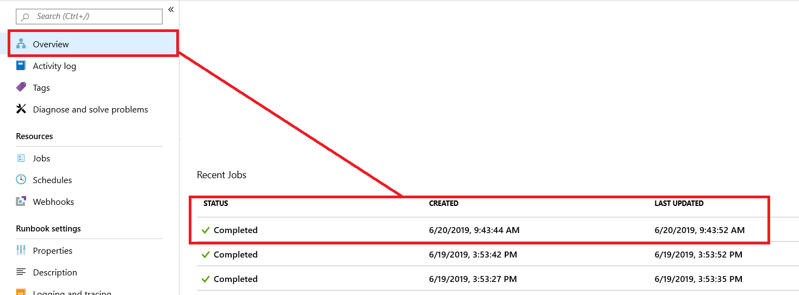

# Onboarding to Notifications for Azure Key Vault (PREVIEW)

Key Vault Notifications is a new feature that is in preview. It is designed to allow users to be notified when the status of a secret stored in key vault has changed. A status change is defined as a secret that is about to expire (within 30 days of expiration), a secret that has expired, or a secret that has a new version available. Notifications for all 3 secret types (key, certificate, and secret) are supported.

This feature allows users to 'listen' for status updates to their key vault by leveraging Event Grid instead of having to continuously poll key vault to find out if a status change has occurred.

This feature also allows users to respond to status changes in their key vaults programmatically using Azure Automation.

This document will help walk you through the process of setting up notifications for Key Vault.

## Prerequisites

This feature is currently in preview. You need to request access before proceeding with the steps listed in this document.

Visit **http://aka.ms/keyvaultnotifications** and submit your Azure subscription id to the intake form and wait for confirmation that your subscriptions have been whitelisted to use this feature before proceeding.

## Feature Overview

Event Grid allows you to select an Azure Resource, such as a key vault, to subscribe to and monitor for pre-defined "events". When an event triggers, the result is sent to an endpoint.

An endpoint is a URL that is set up to receive an HTTP POST request from Event Grid. In this example we will use a web hook from Azure Automation that will trigger a runbook to execute when it receives the POST request.

A runbook is an Azure Automation logic application. It is a process automation tool which will allow you to execute a script based on a trigger. In this example, the trigger will be a webhook, and we will execute a PowerShell script.

## Feature Flow Example

Event Grid is subscribed to the key vault as a "topic resource". One of the keys in the key vault is about to expire. Event Grid is notified of the status change of the key in key vault and makes an HTTP POST to an endpoint. In this example, the endpoint is a webhook connected to a runbook. The webhook is triggered, and the runbook PowerShell script executes. The script will programmatically generate a new version of the key.


## Setup Procedure

This procedure assumes that you have the following prerequisites.

1.  You have an Azure Subscription

2.  You have Azure CLI Command Prompt installed on your machine

3.  Your Azure Subscription has been whitelisted to use this feature
    (see prerequisites section above).

4.  You have a key vault in your Azure Subscription.

### Step 1: Configuration

1.  Open the Azure CLI Command Prompt Window and type in the following commands

    a.  az cloud set \--name AzureCloud

    b.  az login

    c.  az account set -s Your Subscription ID

    d.  az provider register \--namespace Microsoft.KeyVault     

### Step 2:Create an Azure Automation Account

1.  Go to portal.azure.com and log in to your subscription

1.  In the search box, type in 'Automation Accounts'

1.  Under the "Services" Section of the drop-down from the search bar, select Automation Accounts.

1.  Click Add 

    

1.  Fill the required information in the "Add Automation Account" Blade and select Create

1.  Wait for your automation account to be created.

### Step 3: Create a Runbook and Webhook


1.  Select the automation account you created in step 1.

1.  Select "Runbooks" under the Process Automation section

1.  Click the "Create a runbook"

1.  Name your runbook and select "PowerShell" as the runbook type

1.  Click on the runbook you created, and select the "Edit" Button

1.  Enter the following code (for testing purposes) and click the "Publish" button. This will output the result of the POST request received.

    
```azurepowershell
param
(
[Parameter (Mandatory = $false)]
[object] $WebhookData
)

#If runbook was called from Webhook, WebhookData will not be null.
if ($WebhookData) {
#Write-Output "WebhookData <$WebhookData>"
$WebhookDataRequestBody = $WebhookData.RequestBody
Write-Output $WebhookDataRequestBody    
}
else
{
# Error
write-Error "No input data found." 
}
```



1.  Select "Webhooks" from the resources section of the runbook you just published

1.  Click "Add Webhook"

    

1.  Select "Create new Webhook"

1. Name the webhook, set an expiration date, and copy the URL

    a.  Please note that you cannot view the URL after you create it. Make sure you copy to clipboard and save it in a secure location where you can access it for the remainder of the tutorial.

1. Select Ok, and Click Create

    a.  You may need to click into the "parameters and run settings" option and select ok before the Create button will be enabled. You don't need to enter any parameters.

    

### Step 4: Create an Event Grid Subscription

1.  Open the Azure Portal using the following link: https://ms.portal.azure.com/?Microsoft_Azure_KeyVault_ShowEvents=true&Microsoft_Azure_EventGrid_publisherPreview=true

1.  Go to your key vault and select the "Events" tab

    a.  If you cannot see the Events tab, make sure that you are using the preview version of the portal (see the link above).

    

1.  Click the "+ Event Subscription" button

1.  Create a descriptive name for the subscription

1.  Choose "Event Grid Schema"

1.  The topic resource should be the key vault you want monitored for status changes

1.  Under event types, choose the specific event types for each secret type you want to monitor. (Default and recommended setting is all)

1.  Select Webhook for endpoint type

1.  When you click select an endpoint, a new context pane will open on the portal. In this field, paste the webhook URL that you created in Step 3 Task 10.

1.  Select Confirm Selection on this context pane

1.  Select Create

    

### Step 5: Testing and Verification

> [!NOTE]
> This test assumes that you have subscribed to the new-version notification for keys in Step 4.
>
> This test assumes that you have the necessary privileges to create a new version of a key in a key vault.




1.  Go to your key vault on the Azure Portal

1.  Create a new key for testing purposes name the key and keep the remaining parameters in their default settings.

1.  Select the key that you have created and create a new version of the
    key.

1.  Now navigate to the events tab in your key vault.

1.  Click on the event grid subscription you created.

1.  Under metrics, see if an event was captured.

    1.  This validates that event grid successfully captured the status change of the key in your key vault.

    

1.  Now go to your azure automation account on the Azure Portal

1.  Select the "Runbooks" tab, and click on the runbook you created

1.  Select the "Webhooks" tab, and look at the "last triggered" timestamp, confirm that this is the same time as when you created the new key version (within 60 seconds).

    1.  This validates that event grid made a POST to the webhook with the event details of the status change in your key vault, and the webhook was triggered.

    

1. Now go back to your Runbook, and select the "Overview" Tab.

1. Look at the Recent Jobs list and you should see that a job was created, and that the status is complete.

    1.  This validates that the webhook triggered the runbook to start executing its script.

    

1. You can drill down even further by selecting the recent job and looking at the actual POST request that was sent from event grid to the webhook.

1. Examine the JSON and make sure that the parameters for your key vault and event type are correct.

    

1. If the "event type" parameter in the JSON object matches the event which occurred in the key vault (in this example, Microsoft.KeyVault.KeyNewVersionCreated) the test was successful.

### So Now What?

Congratulations! If you have followed all the steps above, you are now ready to programmatically respond to status changes of secrets stored in your key vault.

-   If have been using a polling-based system to look for status changes of secrets in your key vaults, migrate to using this notification feature.

-   Replace the test script in your runbook with code to programmatically renew your secrets when they are about to expire.

-   Stay connected with the User Voice forum and get notified when additional notification features become available.

## Troubleshooting

### Unable to create subscription

Reregister Event Grid and Key Vault is registered in your subscription resource providers. See [Azure resource providers and types](../azure-resource-manager/resource-manager-supported-services.md).

## Next steps

- Learn more about [Azure Key Vault](key-vault-overview.md]
- Learn more about [Event Grid](../event-grid/overview.md)
- Learn more about [Azure Automation](../automation/index.yml)
