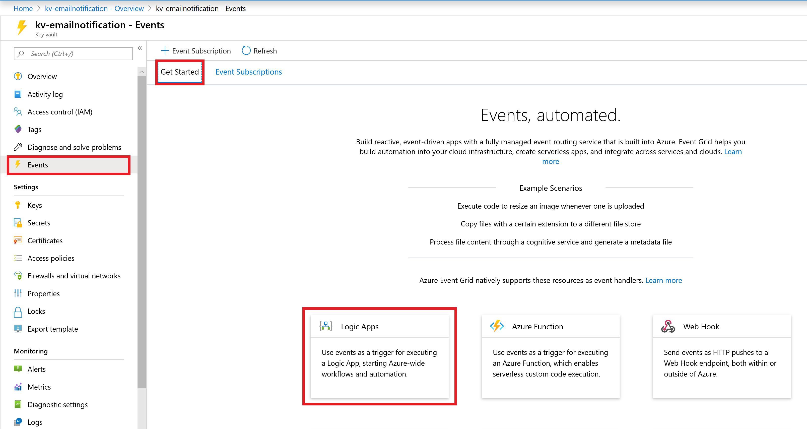
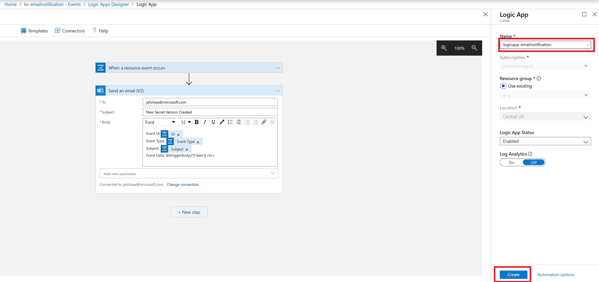

# Email when Key Vault status of the secret changes using Logic Apps

In this guide, you learn how to respond to Azure Key Vault events that are received via Azure Event Grid by using Azure Logic Apps. By the end, you will have an Azure logic app set up to send a notification email every time a secret is created in Azure Key Vault.

## Prerequisites

- An email account from any email provider that is supported by Azure Logic Apps, like Office 365 Outlook. This email account is used to send the event notifications. For a complete list of supported Logic App connectors, see the [Connectors overview](https://docs.microsoft.com/connectors/)
- An Azure subscription. If you don't have an Azure subscription, create a [free account](https://azure.microsoft.com/free/?WT.mc_id=A261C142F) before you begin.
- A key vault in your Azure Subscription. You can quickly create a new key vault by following the steps in [Set and retrieve a secret from Azure Key Vault using Azure CLI](quick-create-cli.md).

## Create a Logic App via Event Grid
In this section, you create Logic App with event grid handler and subscribe to Azure Key Vault "SecretNewVersionCreated" events.

To create an Azure Event Grid subscription, follow these steps:

1. Open the Azure portal using the following link: https://portal.azure.com/?Microsoft_Azure_KeyVault_ShowEvents=true&Microsoft_Azure_EventGrid_publisherPreview=true 
2. In the Azure portal, go to your key vault and then select **Events > Get Started** and click **Logic Apps**

    
    
2. On **Logic Apps Designer** validate connection and click **Continue** 
 
    
3. On the **When a a resource event occurs** component, do the following steps:
    - Select **Microsoft.KeyVault.vaults** for the **Resource Type**. 
    - Select **Microsoft.KeyVault.SecretNewVersionCreated** for **Event Type Item - 1**. 
    - **Subscription** and **Resource Name** can be left as default.

    

4. Select **+ New Step** This will open a window to Choose an action.
5. Search for **Email**. Based on your email provider, find and select the matching connector. This tutorial uses **Office 365 Outlook**. The steps for other email providers are similar.
6. Select the **Send an email** action.
   
   
7. Build your email template.
    - **To:** Enter the email address to receive the notification emails. For this tutorial, use an email account that you can access for testing.
    - **Subject** and **Body**: Write the text for your email. Select JSON properties from the selector tool to include dynamic content based on event data. 
Your email template may look like this example:
    
    
8. Click **Save as** 
9. Enter a **name** for new logic app and click **Create**
    
    
### Testing and Verification
1.  Go to your key vault on the Azure Portal and select **Events > Event Subscriptions**
2.  Notice new subscription created
    
    
3.  Create a new secret for testing purposes name the key and keep the remaining parameters in their default settings.

4.  Email should be received on address provided 

## Next steps

* [Route key vault notifications to Azure Automation](event-grid-tutorial.md)
* [Monitoring Key Vault with Azure Event Grid (preview)](event-grid-overview.md)
* Learn more about [Azure Event Grid](https://docs.microsoft.com/azure/event-grid/).
* Learn more about the [Logic Apps feature of Azure App Service](https://docs.microsoft.com/azure/logic-apps/).

