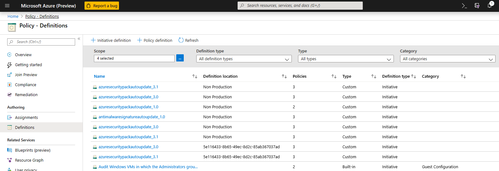
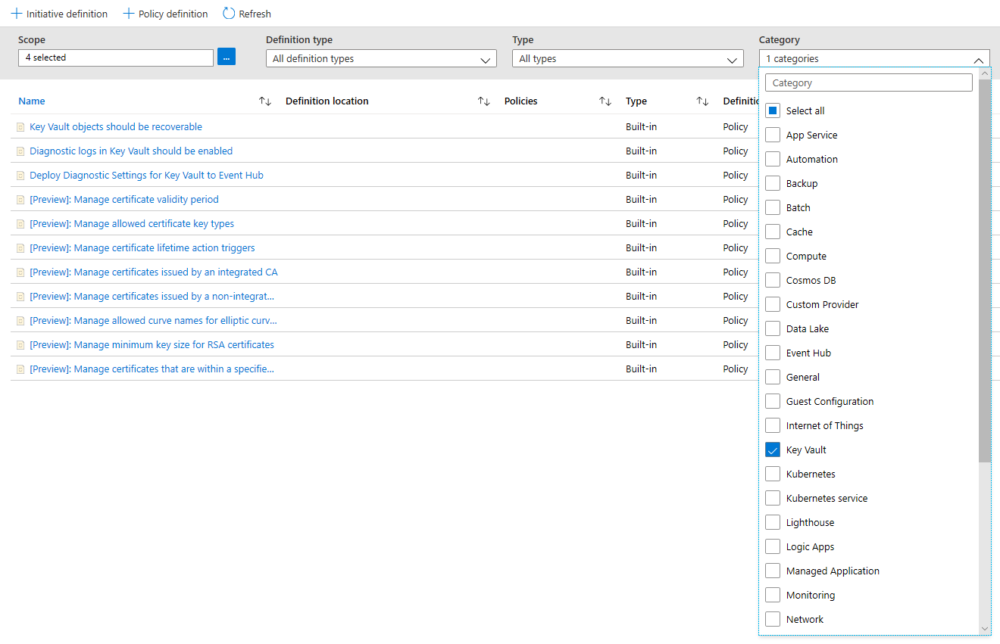
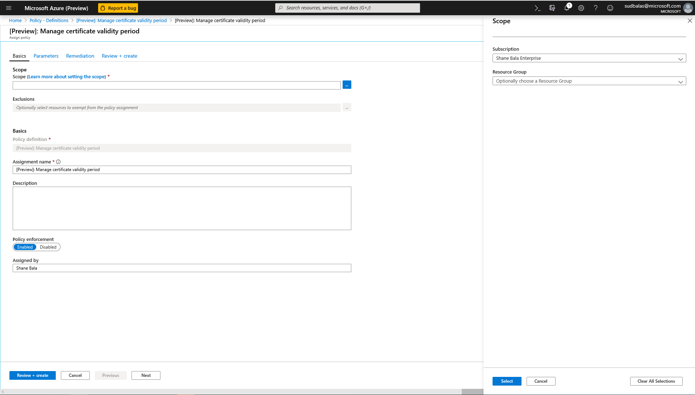
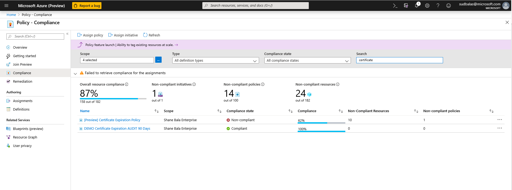
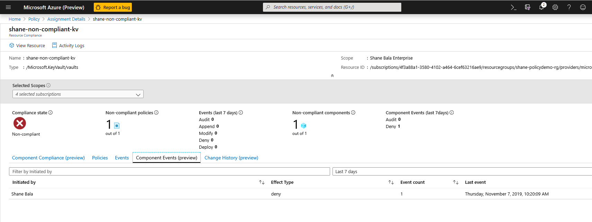

# Integrate Azure Key vault with Azure Policy

[Azure Policy](../../governance/policy/index.yml) is a governance tool that gives users the ability to audit and manage their Azure environment at scale. Azure Policy provides the ability to place guardrails on Azure resources to ensure they are compliant with assigned policy rules. It allows users to perform audit, real-time enforcement, and remediation of their Azure environment. The results of audits performed by policy will be available to users in a compliance dashboard where they will be able to see a drill down of which resources and components are compliant and which are not.  For more information, see the [Overview of the Azure Policy service](../../governance/policy/overview.md).

Example Usage Scenarios:

- You want to improve the security posture of your company by implementing requirements around minimum key sizes and maximum validity periods of certificates in your company's key vaults but you don't know which teams will be compliant and which are not.
- You currently don't have a solution to perform an audit across your organization, or you are conducting manual audits of your environment by asking individual teams within your organization to report their compliance. You are looking for a way to automate this task, perform audits in real time, and guarantee the accuracy of the audit.
- You want to enforce your company security policies and stop individuals from creating self-signed certificates, but you don't have an automated way to block their creation. 
- You want to relax some requirements for your test teams, but you want to maintain tight controls over your production environment. You need a simple automated way to separate enforcement of your resources.
- You want to be sure that you can roll-back enforcement of new policies in the event of a live-site issue. You need a one-click solution to turn off enforcement of the policy.
- You are relying on a 3rd party solution for auditing your environment and you want to use an internal Microsoft offering.

## Types of policy effects and guidance

When enforcing a policy, you can determine its effect over the resulting evaluation. Each policy definition allows you to choose one of multiple effects. Therefore, policy enforcement may behave differently depending on the type of operation you are evaluating. In general, the effects for policies that integrate with Key vault include:

- [**Audit**](https://learn.microsoft.com/azure/governance/policy/concepts/effects#audit): when the effect of a policy is set to `Audit`, the policy will not cause any breaking changes to your environment. It will only alert you to components such as certificates that do not comply with the policy definitions within a specified scope, by marking these components as non-compliant in the policy compliance dashboard. Audit is default if no policy effect is selected.

- [**Deny**](https://learn.microsoft.com/azure/governance/policy/concepts/effects#deny): when the effect of a policy is set to `Deny`, the policy will block the creation of new components such as certificates as well as block new versions of existing components that do not comply with the policy definition. Existing non-compliant resources within a key vault are not affected. The 'audit' capabilities will continue to operate.

- [**Disabled**](https://learn.microsoft.com/azure/governance/policy/concepts/effects#disabled): when the effect of a policy is set to `Disabled`, the policy will still be evaluated but enforcement will not take effect, thus being compliant for the condition with `Disabled` effect. This is useful to disable the policy for a specific condition as opposed to all conditions.
 
- [**Modify**](https://learn.microsoft.com/azure/governance/policy/concepts/effects#modify): when the effect of a policy is set to `Modify`, you can perform addition of resource tags, such as adding the `Deny` tag to  a network. This is useful to disable access to a public network for Azure Key vault managed HSM. It is necessary to [configure a manage identity](https://learn.microsoft.com/azure/governance/policy/how-to/remediate-resources?tabs=azure-portal#configure-the-managed-identity) for the policy definition via the `roleDefinitionIds` parameter to utilize the `Modify` effect.

- [**DeployIfNotExists**](https://learn.microsoft.com/azure/governance/policy/concepts/effects#deployifnotexists): when the effect of a policy is set to `DeployIfNotExists`, a deployment template is executed when the condition is met. This can be used to configure diagnostic settings for key vault to log analytics workspace. It is necessary to [configure a manage identity](https://learn.microsoft.com/azure/governance/policy/how-to/remediate-resources?tabs=azure-portal#configure-the-managed-identity) for the policy definition via the `roleDefinitionIds` parameter to utilize the `DeployIfNotExists` effect.

- [**AuditIfNotExists**](https://learn.microsoft.com/azure/governance/policy/concepts/effects#deployifnotexists): when the effect of a policy is set to `AuditIfNotExists`, you can identify resources that lack the properties specified in the details of the policy condition. This is useful to identify key vaults that have no resource logs enabled. It is necessary to [configure a manage identity](https://learn.microsoft.com/azure/governance/policy/how-to/remediate-resources?tabs=azure-portal#configure-the-managed-identity) for the policy definition via the `roleDefinitionIds` parameter to utilize the `DeployIfNotExists` effect.

## Available Built-In Policy Definitions

A group of 'built-in' policies is available for so that you don't have to write custom policies in JSON format to enforce commonly used rules associated with best practices for Azure Key Vault. In some cases you may have to define parameters for built-in policies, however, you can do this through the portal interface; you don't have to modify the JSON definition to input a parameter. Built-in policies are associated with key vault management, certificates, keys, and secrets operations.

### [Key Vault Management](#tab/keyvault)

<h5 style="text-align: center;"> [New] Initiatives </h5>

- [**[New]** Key vaults should have identity and access management](#key-vault-management)

- [**[New | HSM]** Key vault managed HSMs should have identity and access management](#key-vault-management)

- [**[New]** Key vaults should have network access management](#key-vault-management)

- [**[New | HSM]** Key vault managed HSMs should have network access management](#key-vault-management)

- [**[New]** Key vaults should have monitoring management](#key-vault-management)

- [**[New | HSM]** Key vault managed HSMs should have monitoring management](#key-vault-management)

 

---
---
---

#### **[New]** Identity and Access Management

- [**[New | FortKnox Ask]** Key vaults should only use Azure Active Directory for authentication](#new-identity-and-access-management) Effects: Audit _(Default)_, Deny, Disabled

- [**[New | HSM]** Key vault managed HSMs should only use Azure Active Directory for authentication](#new-identity-and-access-management) Effects: Audit _(Default)_, Deny, Disabled

[[LINK - RBAC Migration]](https://learn.microsoft.com/azure/key-vault/general/rbac-migration#create-and-assign-policy-definition-for-key-vault-azure-rbac-permission-model)
 Using the Azure Policy service, you can govern the migration to the RBAC permission model across vaults, by auditing existing key vaults and enforcing all new key vaults to use the Azure RBAC permission model.

- [**[New | Jack Ask]** Key vaults should use the RBAC permission model](#new-identity-and-access-management) Effects: Audit _(Default)_, Deny, Disabled

- [**[New | HSM]** Key vault managed HSMs should use the RBAC permission model](#new-identity-and-access-management) Effects: Audit _(Default)_, Deny, Disabled

#### Network Access

Restrict  public network access for your key vault (with or without managed HSM) so that it's not accessible over the public internet. This can reduce data leakage risks.

- [Key vaults should disable public network access](https://portal.azure.com/#blade/Microsoft_Azure_Policy/PolicyDetailBlade/definitionId/%2Fproviders%2FMicrosoft.Authorization%2FpolicyDefinitions%2F405c5871-3e91-4644-8a63-58e19d68ff5b)
 Effects: Audit _(Default)_, Deny, Disabled

- [**[Preview]**: Key vault managed HSMs should disable public network access](https://portal.azure.com/#blade/Microsoft_Azure_Policy/PolicyDetailBlade/definitionId/%2Fproviders%2FMicrosoft.Authorization%2FpolicyDefinitions%2F19ea9d63-adee-4431-a95e-1913c6c1c75f) Effects: Audit _(Default)_, Deny, Disabled

- [**[New]**: Configure key vaults to disable public network access](#network-access) Effects: Modify _(Default)_, Disabled

- [**[Preview]**: Configure key vault managed HSMs to disable public network access](https://portal.azure.com/#blade/Microsoft_Azure_Policy/PolicyDetailBlade/definitionId/%2Fproviders%2FMicrosoft.Authorization%2FpolicyDefinitions%2F84d327c3-164a-4685-b453-900478614456) Effects: Modify _(Default)_, Disabled

[Azure Private Link](https://azure.microsoft.com/products/private-link/) lets you connect your virtual networks to Azure services without a public IP address at the source or destination. The Private Link platform handles the connectivity between the consumer and services over the Azure backbone network. By mapping private endpoints to a key vault (with or without managed HSM), you can reduce data leakage risks.

- [**[Preview]**: Key vaults should use private link **(Duplicate)**](https://portal.azure.com/#blade/Microsoft_Azure_Policy/PolicyDetailBlade/definitionId/%2Fproviders%2FMicrosoft.Authorization%2FpolicyDefinitions%2Fa6abeaec-4d90-4a02-805f-6b26c4d3fbe9) Effects: Audit _(Default)_, Deny, Disabled

> [!IMPORTANT]
>- [**[BUG | EXTERNAL] ... [Preview]**: Private endpoint should be configured for key vaults](https://portal.azure.com/#blade/Microsoft_Azure_Policy/PolicyDetailBlade/definitionId/%2Fproviders%2FMicrosoft.Authorization%2FpolicyDefinitions%2F5f0bc445-3935-4915-9981-011aa2b46147) Effects: Audit _(Default)_, Deny, Disabled

- [**[Preview]**: Key vault managed HSMs should use private link **(Duplicate)**](https://portal.azure.com/#blade/Microsoft_Azure_Policy/PolicyDetailBlade/definitionId/%2Fproviders%2FMicrosoft.Authorization%2FpolicyDefinitions%2F59fee2f4-d439-4f1b-9b9a-982e1474bfd8) Effects: Audit _(Default)_, Deny, Disabled

- [**[New | HSM]** : Private endpoint should be configured for key vault managed HSMs](#network-access) Effects: Audit _(Default)_, Deny, Disabled

- [**[Preview]**: Configure key vaults with private endpoints](https://portal.azure.com/#blade/Microsoft_Azure_Policy/PolicyDetailBlade/definitionId/%2Fproviders%2FMicrosoft.Authorization%2FpolicyDefinitions%2F9d4fad1f-5189-4a42-b29e-cf7929c6b6df) Effects: DeployIfNotExists _(Default)_, Disabled

- [**[Preview]**: Configure key vault managed HSMs with private endpoints](https://portal.azure.com/#blade/Microsoft_Azure_Policy/PolicyDetailBlade/definitionId/%2Fproviders%2FMicrosoft.Authorization%2FpolicyDefinitions%2Fd1d6d8bb-cc7c-420f-8c7d-6f6f5279a844) Effects: DeployIfNotExists _(Default)_, Disabled

Use private DNS zones to override the DNS resolution for a private endpoint. A private DNS zone links to your virtual network to resolve to key vault.

- [**[Preview]**: Configure key vaults to use private DNS zones](https://portal.azure.com/#blade/Microsoft_Azure_Policy/PolicyDetailBlade/definitionId/%2Fproviders%2FMicrosoft.Authorization%2FpolicyDefinitions%2Fac673a9a-f77d-4846-b2d8-a57f8e1c01d4) Effects: DeployIfNotExists _(Default)_, Disabled

- [**[New | HSM]**: Configure key vault managed HSMs to use private DNS zones](#private-dns-zones) Effects: DeployIfNotExists _(Default)_, Disabled

Enable the [key vault firewall](https://learn.microsoft.com/azure/key-vault/general/network-security) so that the key vault is not accessible by default to any public IPs. You can then configure specific IP ranges to limit access to those networks.

- [Key vaults should have firewall enabled](https://portal.azure.com/#blade/Microsoft_Azure_Policy/PolicyDetailBlade/definitionId/%2Fproviders%2FMicrosoft.Authorization%2FpolicyDefinitions%2F55615ac9-af46-4a59-874e-391cc3dfb490) Effects: Audit _(Default)_, Deny, Disabled

- [Configure key vaults to enable firewall](https://portal.azure.com/#blade/Microsoft_Azure_Policy/PolicyDetailBlade/definitionId/%2Fproviders%2FMicrosoft.Authorization%2FpolicyDefinitions%2Fac673a9a-f77d-4846-b2d8-a57f8e1c01dc) Effects: Modify _(Default)_, Disabled

 

---

#### Monitoring

Prevent permanent data loss of your key vault objects by enabling [soft-delete and purge protection](https://learn.microsoft.com/azure/key-vault/general/soft-delete-overview). While soft-delete allows you to recover an accidentally deleted key vault for a configurable retention period, purge protection protects you from insider attacks by enforcing a mandatory retention period for soft-deleted key vaults. Purge protection can only be enabled once soft-delete is enabled.

- [Key vaults should have soft delete enabled](https://portal.azure.com/#blade/Microsoft_Azure_Policy/PolicyDetailBlade/definitionId/%2Fproviders%2FMicrosoft.Authorization%2FpolicyDefinitions%2F1e66c121-a66a-4b1f-9b83-0fd99bf0fc2d) Effects: Audit _(Default)_, Deny, Disabled

- [Key vaults should have purge protection enabled](https://portal.azure.com/#blade/Microsoft_Azure_Policy/PolicyDetailBlade/definitionId/%2Fproviders%2FMicrosoft.Authorization%2FpolicyDefinitions%2F0b60c0b2-2dc2-4e1c-b5c9-abbed971de53) Effects: Audit _(Default)_, Deny, Disabled

- [Key vault managed HSMs should have purge protection enabled](https://portal.azure.com/#blade/Microsoft_Azure_Policy/PolicyDetailBlade/definitionId/%2Fproviders%2FMicrosoft.Authorization%2FpolicyDefinitions%2Fc39ba22d-4428-4149-b981-70acb31fc383) Effects: Audit _(Default)_, Deny, Disabled

Audit enabling of resource logs. This enables you to recreate activity trails to use for investigation purposes when a security incident occurs or when your network is compromised

- [Deploy diagnostic settings for key vaults to an Event Hub](https://portal.azure.com/#blade/Microsoft_Azure_Policy/PolicyDetailBlade/definitionId/%2Fproviders%2FMicrosoft.Authorization%2FpolicyDefinitions%2Fed7c8c13-51e7-49d1-8a43-8490431a0da2) Effects: DeployIfNotExists _(Default)_

- [Deploy diagnostic settings for key vault managed HSMs to an Event Hub](https://portal.azure.com/#blade/Microsoft_Azure_Policy/PolicyDetailBlade/definitionId/%2Fproviders%2FMicrosoft.Authorization%2FpolicyDefinitions%2Fa6d2c800-5230-4a40-bff3-8268b4987d42) Effects: DeployIfNotExists _(Default)_, Disabled

- [Deploy diagnostic settings for key vaults to Log Analytics workspace](https://portal.azure.com/#blade/Microsoft_Azure_Policy/PolicyDetailBlade/definitionId/%2Fproviders%2FMicrosoft.Authorization%2FpolicyDefinitions%2F951af2fa-529b-416e-ab6e-066fd85ac459) Effects: DeployIfNotExists _(Default)_, Disabled

- [**[New | HSM]** Deploy diagnostic settings for key vault managed HSMs to Log Analytics workspace](#logs) Effects: DeployIfNotExists _(Default)_, Disabled

- [Resource logs in key vaults should be enabled](https://portal.azure.com/#blade/Microsoft_Azure_Policy/PolicyDetailBlade/definitionId/%2Fproviders%2FMicrosoft.Authorization%2FpolicyDefinitions%2Fcf820ca0-f99e-4f3e-84fb-66e913812d21) Effects: AuditIfNotExists _(Default)_, Disabled

- [Resource logs in key vault managed HSMs should be enabled](https://portal.azure.com/#blade/Microsoft_Azure_Policy/PolicyDetailBlade/definitionId/%2Fproviders%2FMicrosoft.Authorization%2FpolicyDefinitions%2Fa2a5b911-5617-447e-a49e-59dbe0e0434b) Effects: AuditIfNotExists _(Default)_, Disabled

Malicious deletion of a key vault can lead to permanent data loss. A malicious insider in your organization can potentially delete and purge key vaults. Purge protection protects you from insider attacks by enforcing a mandatory retention period for soft deleted key vaults. No one inside your organization or Microsoft will be able to purge your key vaults during the soft delete retention period.

 

---
### [Certificates](#tab/certificates)

<h5 style="text-align: center;"> [New] Initiatives</h5>

- [**[New | Secret Analytics Ask]** Certificates should have lifecycle  management](#certificates)

 

---
---
---

#### Certificate Lifecycle Management

> [!IMPORTANT]
>- **[New | Partner Ask MPAC bug]** Certificates should be password protected | _Consider providing policy to prevent exporting clear text private keys. When using the “Download in PFX/PEM format” to export a certificate from an AKV, the user gets a warning that the file may “contain a private key without password protection”. The recommendation to “store the file somewhere secure” is meaningless at this point, as it is an unprotected secret, generated by a Microsoft product, without giving the user an option to protect the secret. These files CAN and SHOULD be password protected, but MPAC AKV seems to have opted not to implement this, creating a systematic condition where users have no way to export private keys securely._

Your service can experience an outage if a certificate that is not being adequately monitored is not rotated prior to its expiration. This policy is critical to making sure that your certificates stored in key vault are being monitored. It is recommended that you apply this policy multiple times with different expiration thresholds, for example, at 180, 90, 60, and 30-day thresholds. This policy can be used to monitor and triage certificate expiration in your organization. 

This policy allows you to manage the lifetime action specified for certificates that are either within a certain number of days of their expiration or have reached a certain percentage of their usable life.

This policy allows you to manage the maximum validity period of your certificates stored in key vault. It is a good security practice to limit the maximum validity period of your certificates. If a private key of your certificate were to become compromised without detection, using short lived certificates minimizes the time frame for ongoing damage and reduces the value of the certificate to an attacker.

- [**[Preview]**: Certificates should have the specified maximum validity period](https://portal.azure.com/#blade/Microsoft_Azure_Policy/PolicyDetailBlade/definitionId/%2Fproviders%2FMicrosoft.Authorization%2FpolicyDefinitions%2F0a075868-4c26-42ef-914c-5bc007359560)

- [**[Preview]**: Certificates should not expire within the specified number of days
](https://portal.azure.com/#blade/Microsoft_Azure_Policy/PolicyDetailBlade/definitionId/%2Fproviders%2FMicrosoft.Authorization%2FpolicyDefinitions%2Ff772fb64-8e40-40ad-87bc-7706e1949427)

- [Certificates should have the specified lifetime action triggers](https://portal.azure.com/#blade/Microsoft_Azure_Policy/PolicyDetailBlade/definitionId/%2Fproviders%2FMicrosoft.Authorization%2FpolicyDefinitions%2F12ef42cb-9903-4e39-9c26-422d29570417)

 

---

#### Certificate Authority

If you use a key vault integrated certificate authority (Digicert or GlobalSign) and you want users to use one or either of these providers, you can use this policy to audit or enforce your selection. This policy will evaluate the CA selected in the issuance policy of the cert and the CA provider defined in the key vault. This policy can also be used to audit or deny the creation of self-signed certificates in key vault.

If you use an internal certificate authority or a certificate authority not integrated with key vault and you want users to use a certificate authority from a list you provide, you can use this policy to create an allowed list of certificate authorities by issuer name. This policy can also be used to audit or deny the creation of self-signed certificates in key vault.

- [Certificates should be issued by the specified integrated certificate authority
](https://portal.azure.com/#blade/Microsoft_Azure_Policy/PolicyDetailBlade/definitionId/%2Fproviders%2FMicrosoft.Authorization%2FpolicyDefinitions%2F8e826246-c976-48f6-b03e-619bb92b3d82)

> [!IMPORTANT]
> - [**[BUG | INTERNAL]** Certificates should be issued by the specified non-integrated certificate authority
](https://portal.azure.com/#blade/Microsoft_Azure_Policy/PolicyDetailBlade/definitionId/%2Fproviders%2FMicrosoft.Authorization%2FpolicyDefinitions%2Fa22f4a40-01d3-4c7d-8071-da157eeff341)

 

---

#### Certificate Cryptography

This policy allows you to restrict the type of certificates that can be in your key vault. You can use this policy to make sure that your certificate private keys are RSA, ECC, or are HSM backed. You can choose from the following list which certificate types are allowed (RSA, RSA-HSM, ECC, ECC-HSM)

If you use elliptic curve cryptography or ECC certificates, you can customize an allowed list of curve names from the list below. The default option allows all the following curve names (P-256, P-256K, P-384, P-521)

If you use RSA certificates, you can choose a minimum key size that your certificates must have. You may select one option from the list below (2048 bits, 3072 bits, 4096 bits).

- [Certificates should use allowed key types
](https://portal.azure.com/#blade/Microsoft_Azure_Policy/PolicyDetailBlade/definitionId/%2Fproviders%2FMicrosoft.Authorization%2FpolicyDefinitions%2F1151cede-290b-4ba0-8b38-0ad145ac888f)

- [Certificates using elliptic curve cryptography should have allowed curve names
](https://portal.azure.com/#blade/Microsoft_Azure_Policy/PolicyDetailBlade/definitionId/%2Fproviders%2FMicrosoft.Authorization%2FpolicyDefinitions%2Fbd78111f-4953-4367-9fd5-7e08808b54bf)

- [Certificates using RSA cryptography should have the specified minimum key size
](https://portal.azure.com/#blade/Microsoft_Azure_Policy/PolicyDetailBlade/definitionId/%2Fproviders%2FMicrosoft.Authorization%2FpolicyDefinitions%2Fcee51871-e572-4576-855c-047c820360f0)

 

---

### [Keys](#tab/keys)

<h5 style="text-align: center;"> [New] Initiatives</h5>

- [**[New]** Keys should have lifecycle  management](#certificates)

 

---
---
---

#### HSM-backed keys

An HSM is a hardware security module that stores keys. An HSM provides a physical layer of protection for cryptographic keys. The cryptographic key cannot leave a physical HSM which provides a greater level of security than a software key. Some organizations have compliance requirements that mandate the use of HSM keys. Use this policy to audit any keys stored in your key vault that is not HSM backed. You can also use this policy to block the creation of new keys that are not HSM backed. This policy will apply to all key types, RSA and ECC.

- [Keys should be backed by a hardware security module (HSM)](#hsm-backed-keys)

#### Key Lifecycle Management

This policy audits all keys in your key vaults and flags keys that do not have an expiration date set as non-compliant. You can also use this policy to block the creation of keys that do not have an expiration date set.

- [Key Vault keys should have an expiration date](#key-lifecycle-management)

- [**[Preview]**: Managed HSM keys should have an expiration date](#key-lifecycle-management)

If a key is too close to expiration, an organizational delay to rotate the key may result in an outage. Keys should be rotated at a specified number of days prior to expiration to provide sufficient time to react to a failure. This policy will audit keys that are too close to their expiration date and allows you to set this threshold in days. You can also use this policy to prevent the creation of new keys that are too close to their expiration date.

- [Keys should have more than the specified number of days before expiration](#key-lifecycle-management)

- [**[Preview]**: Managed HSM Keys should have more than the specified number of days before expiration](#key-lifecycle-management)

Manage your organizational compliance requirements by specifying the maximum amount of time in days that a key can be valid within your key vault. Keys that are valid longer than the threshold you set will be marked as non-compliant. You can also use this policy to block the creation of new keys that have an expiration date set longer than the maximum validity period you specify.

- [Keys should have the specified maximum validity period](#key-lifecycle-management)

- [**[New | HSM]** Managed HSM keys should have the specified maximum validity period](#key-lifecycle-management)

If you want to make sure that your keys have not been active for longer than a specified number of days, you can use this policy to audit how long your key has been active.

**If your key has an activation date set**, this policy will calculate the number of days that have elapsed from the **activation date** of the key to the current date. If the number of days exceeds the threshold you set, the key will be marked as non-compliant with the policy.

**If your key does not have an activation date set**, this policy will calculate the number of days that have elapsed from the **creation date** of the key to the current date. If the number of days exceeds the threshold you set, the key will be marked as non-compliant with the policy.

- [Keys should not be active for longer than the specified number of days](#key-lifecycle-management)

- [**[New | HSM]** Managed HSM keys should not be active for longer than the specified number of days](#key-lifecycle-management)

#### Key Cryptography

This policy allows you to restrict the type of keys that can be in your key vault. You can use this policy to make sure that your keys are RSA, ECC, or are HSM backed. You can choose from the following list which certificate types are allowed (RSA, RSA-HSM, ECC, ECC-HSM).

- [Keys should be of the specified cryptographic type RSA or EC](#key-cryptography)

- [**[New | HSM]** Managed HSM keys should be of the specified cryptographic type RSA or EC](#key-cryptography)

If you use elliptic curve cryptography or ECC keys, you can customize an allowed list of curve names from the list below. The default option allows all the following curve names (P-256, P-256K, P-384, P-521)

- [Keys using elliptic curve cryptography should have the specified curve names](#key-cryptography)

- [**[Preview]**: Managed HSM keys using elliptic curve cryptography should have the specified curve names](#key-cryptography)

Using RSA keys with smaller key sizes is not a secure design practice. You may be subject to audit and certification standards that mandate the use of a minimum key size. The following policy allows you to set a minimum key size requirement on your key vault. You can audit keys that do not meet this minimum requirement. This policy can also be used to block the creation of new keys that do not meet the minimum key size requirement.

- [Keys using RSA cryptography should have a specified minimum key size](#key-cryptography)

- [**[Preview]**: Managed HSM keys using RSA cryptography - should have a specified minimum key size](#key-cryptography)

 

---

### [Secrets](#tab/secrets)

<h5 style="text-align: center;"> [New] Initiatives</h5>

- [**[New]** Secrets should have lifecycle  management](#certificates)

 

---
---
---

#### Secret Lifecycle Management

This policy audits all secrets in your key vault and flags secrets that do not have an expiration date set as non-compliant. You can also use this policy to block the creation of secrets that do not have an expiration date set.

- [Key Vault secrets should have an expiration date](#secret-lifecycle-management)

If a secret is too close to expiration, an organizational delay to rotate the secret may result in an outage. Secrets should be rotated at a specified number of days prior to expiration to provide sufficient time to react to a failure. This policy will audit secrets that are too close to their expiration date and allows you to set this threshold in days. You can also use this policy to prevent the creation of new secrets that are too close to their expiration date.

- [Secrets should have more than the specified number of days before expiration](#secret-lifecycle-management)

Manage your organizational compliance requirements by specifying the maximum amount of time in days that a secret can be valid within your key vault. Secrets that are valid longer than the threshold you set will be marked as non-compliant. You can also use this policy to block the creation of new secrets that have an expiration date set longer than the maximum validity period you specify.

- [Secrets should have the specified maximum validity period](#secret-lifecycle-management)

If you want to make sure that your secrets have not been active for longer than a specified number of days, you can use this policy to audit how long your secret has been active.

**If your secret has an activation date set**, this policy will calculate the number of days that have elapsed from the **activation date** of the secret to the current date. If the number of days exceeds the threshold you set, the secret will be marked as non-compliant with the policy.

**If your secret does not have an activation date set**, this policy will calculate the number of days that have elapsed from the **creation date** of the secret to the current date. If the number of days exceeds the threshold you set, the secret will be marked as non-compliant with the policy.

- [Secrets should not be active for longer than the specified number of days](#secret-lifecycle-management)

#### Typing

Any plain text or encoded file can be stored as a key vault secret. However, your organization may want to set different rotation policies and restrictions on passwords, connection strings, or certificates stored as keys. A content type tag can help a user see what is stored in a secret object without reading the value of the secret. You can use this policy to audit secrets that don't have a content type tag set. You can also use this policy to prevent new secrets from being created if they don't have a content type tag set.

- [Secrets should have content type set]()

 

---

## Example Scenario

You manage a key vault used by multiple teams that contains 100 certificates, and you want to make sure that none of the certificates in the key vault are valid for longer than 2 years.

1. You assign the **Certificates should have the specified maximum validity period** policy, specify that the maximum validity period of a certificate is 24 months, and set the effect of the policy to "audit". 
1. You view the [compliance report on the Azure portal](#view-compliance-results), and discover that 20 certificates are non-compliant and valid for > 2 years, and the remaining certificates are compliant. 
1. You contact the owners of these certificates and communicate the new security requirement that certificates cannot be valid for longer than 2 years. Some teams respond and 15 of the certificates were renewed with a maximum validity period of 2 years or less. Other teams do not respond, and you still have 5 non-compliant certificates in your key vault.
1. You change the effect of the policy you assigned to "deny". The 5 non-compliant certificates are not revoked, and they continue to function. However, they cannot be renewed with a validity period that is greater than 2 years. 

## Enabling and managing a Key vault policy through the Azure portal

### Select a Policy Definition

1. Log in to the Azure portal. 
1. Search "Policy" in the Search Bar and Select **Policy**.

    

1. In the Policy window, select **Definitions**.

    

1. In the Category Filter, Unselect **Select All** and select **Key Vault**. 

    

1. Now you should be able to see all the policies available for Public Preview, for Azure Key Vault. Make sure you have read and understood the policy guidance section above and select a policy you want to assign to a scope.  

    

### Assign a Policy to a Scope 

1. Select a policy you wish to apply, in this example, the **Manage Certificate Validity Period** policy is shown. Click the assign button in the top-left corner.

    
  
1. Select the subscription where you want the policy to be applied. You can choose to restrict the scope to only a single resource group within a subscription. If you want to apply the policy to the entire subscription and exclude some resource groups, you can also configure an exclusion list. Set the policy enforcement selector to **Enabled** if you want the effect of the policy (audit or deny) to occur or **Disabled** to turn the effect (audit or deny) off. 

    

1. Click on the parameters tab at the top of the screen in order to specify the maximum validity period in months that you want. If you need to input the parameters, you can uncheck 'Only show parameters that need input or review' option. Select **audit** or **deny** for the effect of the policy following the guidance in the sections above. Then select the review + create button. 

    

### View Compliance Results

1. Go back to the Policy blade and select the compliance tab. Click on the policy assignment you wish to view compliance results for.

    

1. From this page you can filter results by compliant or non-compliant vaults. Here you can see a list of non-compliant key vaults within the scope of the policy assignment. A vault is considered non-compliant if any of the components (certificates) in the vault are non-compliant. You can select an individual vault to view the individual non-compliant components (certificates). 

    

1. View the name of the components within a vault that are non-compliant

    

1. If you need to check whether users are being denied the ability to create resources within key vault, you can click on the **Component Events (preview)** tab to view a summary of denied certificate operations with the requestor and timestamps of requests. 

    

## Feature Limitations

Assigning a policy with a "deny" effect may take up to 30 mins (average case) and 1 hour (worst case) to start denying the creation of non-compliant resources. The delay refers to following scenarios -
1.	A new policy is assigned
2.	An existing policy assignment is modified
3.	A new KeyVault (resource) is created in a scope with existing policies.

The policy evaluation of existing components in a vault may take up to 1 hour (average case) and 2 hours (worst case) before compliance results are viewable in the portal UI. 
If the compliance results show up as "Not Started" it may be due to the following reasons:
- The policy valuation has not completed yet. Initial evaluation latency can take up to 2 hours in the worst-case scenario. 
- There are no key vaults in the scope of the policy assignment.
- There are no key vaults with certificates within the scope of the policy assignment.

> [!NOTE]
> Azure Policy
> [Resouce Provider modes](../../governance/policy/concepts/definition-structure.md#resource-provider-modes),
> such as those for Azure Key Vault, provide information about compliance on the
> [Component Compliance](../../governance/policy/how-to/get-compliance-data.md#component-compliance)
> page.

## Next Steps

- [Logging and frequently asked questions for Azure policy for key vault](../general/troubleshoot-azure-policy-for-key-vault.md)
- Learn more about the [Azure Policy service](../../governance/policy/overview.md)
- See Key vault samples: [Key vault built-in policy definitions](../../governance/policy/samples/built-in-policies.md#key-vault)
- Learn about [Microsoft cloud securiy benchmark on Key vault](/security/benchmark/azure/baselines/key-vault-security-baseline)
