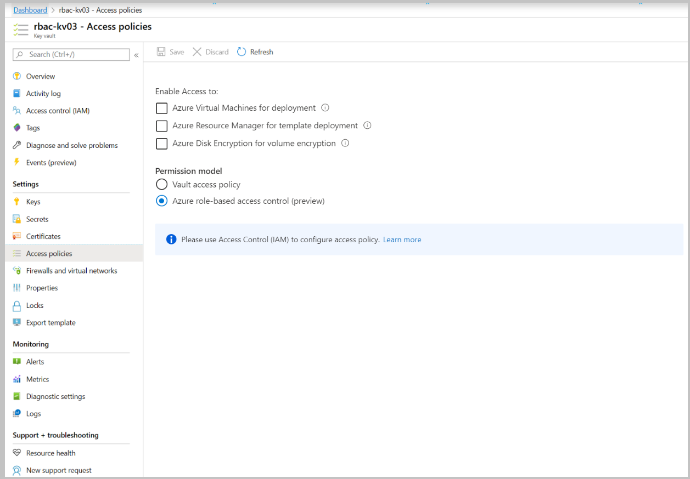
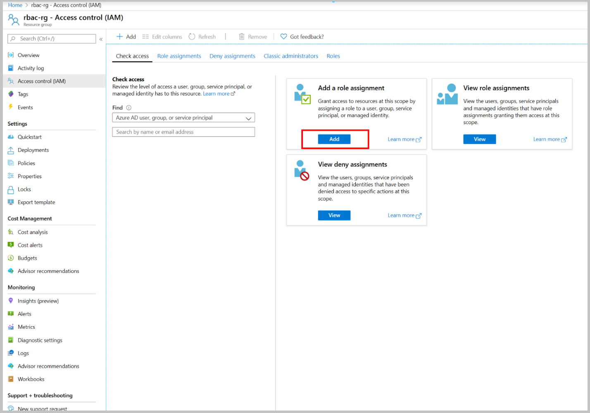
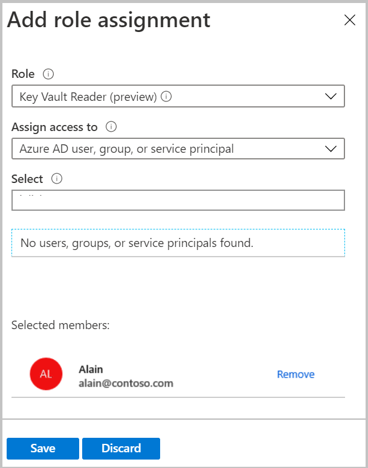
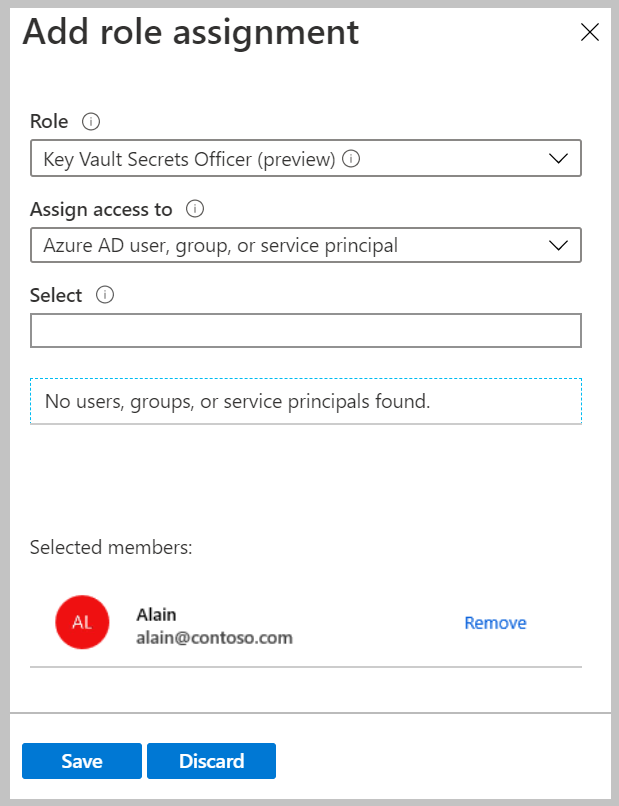
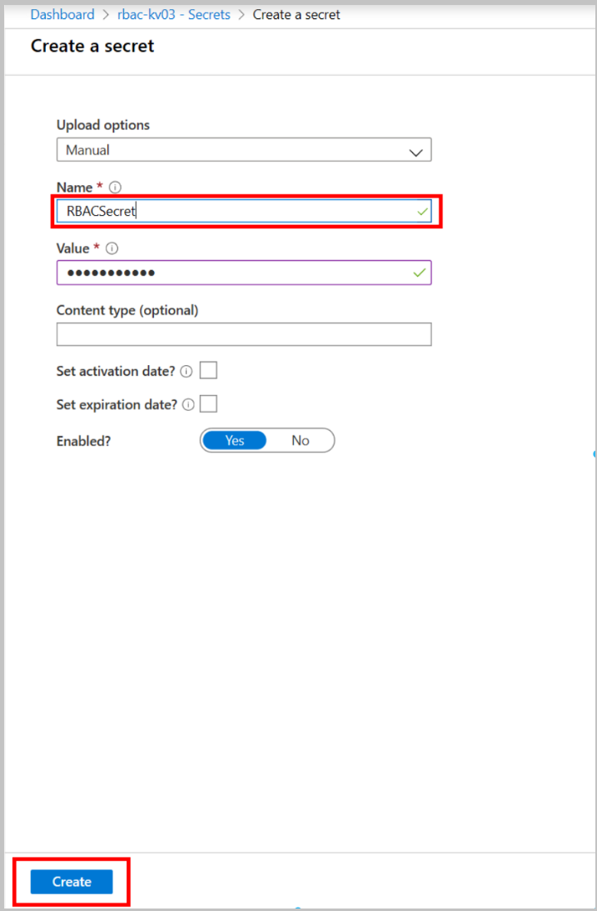
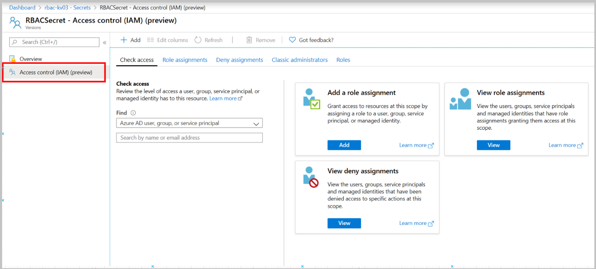
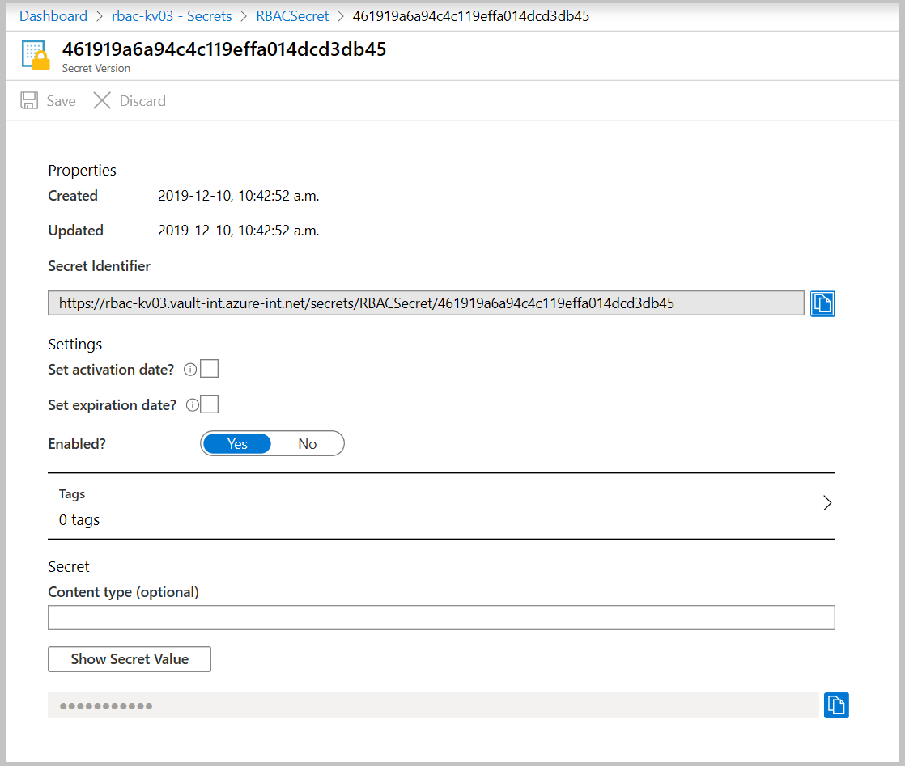
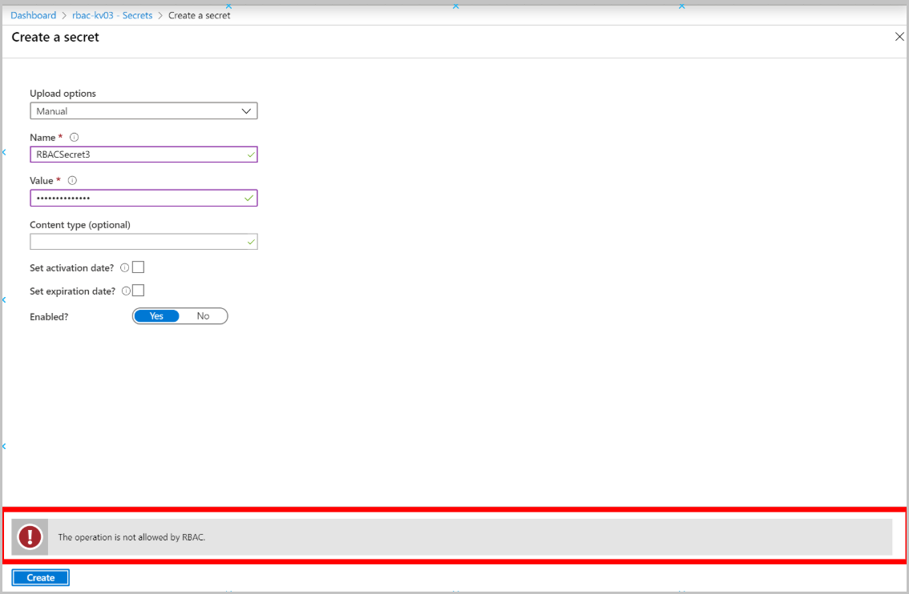
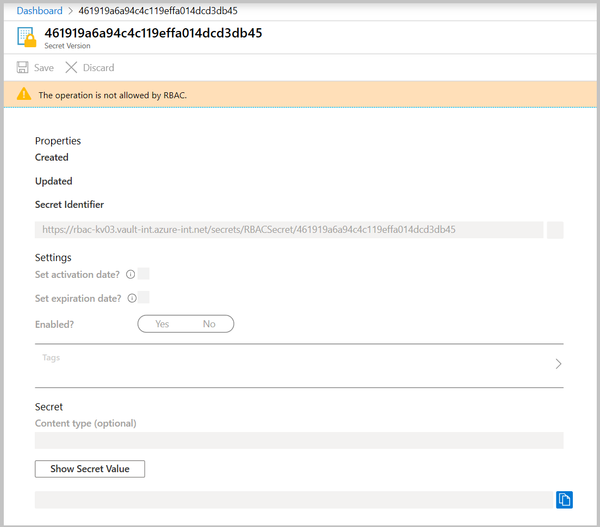
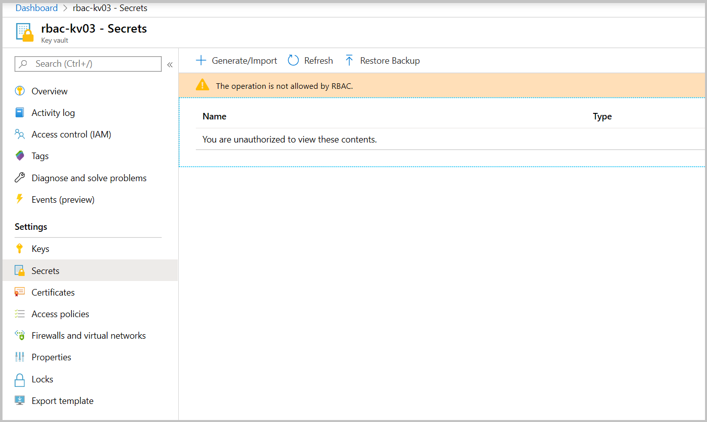

---
title: Grant permission to applications to access an Azure key vault using Azure RBAC | Microsoft Docs
description: Learn how to provide access to keys, secrets, and certificates using Azure role-based access control.
services: key-vault
author: msmbaldwin
manager: rkarlin
ms.service: key-vault
ms.subservice: general
ms.topic: how-to
ms.date: 8/30/2020
ms.author: mbaldwin

---
# Provide access to Key Vault keys, certificates, and secrets with an Azure role-based access control (preview)

Azure role-based access control (Azure RBAC)  is an authorization system built on [Azure Resource
Manager](https://docs.microsoft.com/azure/azure-resource-manager/resource-group-overview)
that provides fine-grained access management of Azure resources.

Azure RBAC allows users to manage Key, Secrets, and Certificates permissions. It provides one place to manage all permissions across all key vaults. Previously Key Vaults object access management was only possible using key vault local access policies, which required you to navigate to each key vault separately

The Azure RBAC model provides the ability to set permissions on different scope levels: management group, subscription, resource group, or individual objects. Apart from the ability to control permissions across key vaults, Azure RBAC for key vault also provides the ability to have separate permissions on individual keys, secrets, and certificates

For more information, see [Role-based access control(RBAC)](https://docs.microsoft.com/azure/role-based-access-control/overview).

## Best Practices for individual keys, secrets and certificates

Our recommendation is to use a vault per application per environment
(Development, Pre-Production and Production).

Individual keys, secrets and certificates permissions should be used
only for specific scenarios:

-   Multi-layer applications that need to separate access control
    between layers

-   Shared key vault with common secrets, when applications need access
    to subsets of secrets in that key vault

More about Azure Key Vault best practices, see:

- [Azure Key Vault best practices](best-practices.md)
- [Azure Key Vault service limits](service-limits.md)

## Azure RBAC built-in roles for Key Vault data plane operations (preview)

> [!div class="mx-tableFixed"]
> | Built-in role | Description | ID |
> | --- | --- | --- |
> | Key Vault Administrator (preview) | Perform all data plane operations on a key vault and  all objects in it, including certificates, keys, and secrets. Cannot manage key vault resources or manage role assignments. Only works for key vaults that use the 'Azure role-based access control' permission model. | 00482a5a-887f-4fb3-b363-3b7fe8e74483 |
> | Key Vault Certificates Officer (preview) | Perform any action on the certificates of a key vault, except manage permissions. Only works for key vaults that use the 'Azure role-based access control' permission model. | a4417e6f-fecd-4de8-b567-7b0420556985 |
> | Key Vault Crypto Officer (preview)| Perform any action on the keys of a key vault, except manage permissions. Only works for key vaults that use the 'Azure role-based access control' permission model. | 14b46e9e-c2b7-41b4-b07b-48a6ebf60603 |
> | Key Vault Crypto Service Encryption (preview) | Read metadata of keys and perform wrap/unwrap operations. Only works for key vaults that use the 'Azure role-based access control' permission model. | e147488a-f6f5-4113-8e2d-b22465e65bf6 |
> | Key Vault Crypto User (preview) | Perform cryptographic operations using keys. Only works for key vaults that use the 'Azure role-based access control' permission model. | 12338af0-0e69-4776-bea7-57ae8d297424 |
> | Key Vault Reader (preview)| Read metadata of key vaults and its certificates, keys, and secrets. Cannot read sensitive values such as secret contents or key material. Only works for key vaults that use the 'Azure role-based access control' permission model. | 21090545-7ca7-4776-b22c-e363652d74d2 |
> | Key Vault Secrets Officer (preview)| Perform any action on the secrets of a key vault, except manage permissions. Only works for key vaults that use the 'Azure role-based access control' permission model. | b86a8fe4-44ce-4948-aee5-eccb2c155cd7 |
> [Key Vault Secrets User (preview)| Read secret contents. Only works for key vaults that use the 'Azure role-based access control' permission model. | 4633458b-17de-408a-b874-0445c86b69e6 |

For more details about Azure RBAC built-in roles definitions, see [Azure role-based access control built-in roles](https://https://docs.microsoft.com/azure/role-based-access-control/built-in-roles).

## Using Azure RBAC Secret, Key, and Certificate Permissions with Key Vault

The new Azure RBAC permission model for key vault replaces the access policies permissions model. You have the option to choose whether to use access policies or Azure RBAC permissions on Key Vault.

Register Azure RBAC Preview Feature using below script:

PowerShell:
```powershell
Register-AzResourceProvider -ProviderNamespace Microsoft.KeyVault   
```

Azure CLI:
```azurecli
az provider register --namespace Microsoft.KeyVault 
```

### Enable Azure RBAC Permissions on Key Vault

Important: Setting Azure RBAC permission model invalidates all access policies permissions. It can cause outages when equivalent Azure RBAC roles are not assigned.

1.  Enable Azure RBAC permissions on new key vault:

> 

2.  Enable Azure RBAC permissions on existing key vault:

> 

### Assign Role

Azure CLI command to create a role assignment:

```azurecli
az role assignment create --role <role_name_or_id> --assignee <assignee> --scope <scope>
```

In the Azure portal, the Azure role assignments screen is available for all resources on the Access control (IAM) tab.



### Resource Group Scope Role Assignment

1.  Go to key vault Resource Group.


2.  Click Access control (IAM) \> Add-role assignment\>Add

3.  Create Key Vault Reader role "Key Vault Reader (preview)" for current user



Azure CLI:
```azurecli
az role assignment create --role "Key Vault Reader (preview)" --assignee {i.e user@microsoft.com} --scope /subscriptions/{subscriptionid}/resourcegroups/{resource-group-name}
```

Above role assignment provides ability to list key vault objects in key vault.

### Key Vault Scope Role Assignment

1. Go to Key Vault \> Access control (IAM) tab

2. Click Add-role assignment\>Add

3. Create Key Secrets Officer role "Key Vault Secrets Officer (preview)" for current user.

> 

 Azure CLI:

```azurecli
az role assignment create --role "Key Vault Secrets Officer (preview)" --assignee {i.e jalichwa@microsoft.com} --scope /subscriptions/{subscriptionid}/resourcegroups/{resource-group-name}/providers/Microsoft.KeyVault/vaults/{key-vault-name}
```

After creating above role assignment you should be able to create/update/delete secrets.

4. Create new secret ( Secrets \> +Generate/Import) for testing secret level role assignment.

> 

### Secret Scope Role Assignment

1. Open one of previously created secrets, notice Overview and Access control (IAM) (preview)

2. Click Access control(IAM)(preview) tab

> 

3. Create Key Secrets Officer role "Key Vault Secrets Officer (preview)" for current user, same like it was done above for the Key Vault.

Azure CLI:

```azurecli
az role assignment create --role "Key Vault Secrets Officer (preview)" --assignee {i.e user@microsoft.com} --scope /subscriptions/{subscriptionid}/resourcegroups/{resource-group-name}/providers/Microsoft.KeyVault/vaults/{key-vault-name}/secrets/RBACSecret
```

### Test and Verify

> [!NOTE]
> Browsers use caching and page refresh is required after removing role assignments.<br>
> Allow several minutes for role assignments to refresh

1. Validate adding new secret without "Key Vault Secrets Officer" role on key vault level.

Go to key vault Access control (IAM) tab and remove "Key Vault Secrets Officer (preview)" role assignment for this resource.


Navigate to previously created secret. You should be able to see all secret properties.



Create new secret ( Secrets \> +Generate/Import) should show below error:



2.  Validate secret editing without "Key Vault Secret Officer" role on secret level.

-   Go to previously created secret Access Control (IAM) (preview) tab
    and remove "Key Vault Secrets Officer (preview)" role assignment for
    this resource.

-   Navigate to previously created secret. You should not be able to see
    secret properties.



3. Validate secrets read without reader role on key vault level.

-   Go to key vault resource group Access control (IAM) tab and remove "Key Vault Reader (preview)" role assignment.

-   Navigating to key vault's Secrets tab should show below error:



### Creating Custom Roles 

[az role definition create command](https://docs.microsoft.com/cli/azure/role/definition#az-role-definition-create)

**(CLI bash script)</br>**
```azurecli
az role definition create --role-definition '{ \
   "Name": "Backup Keys Operator", \
   "Description": "Perform key backup/restore operations", \
    "Actions": [ 
    ], \
    "DataActions": [ \
        "Microsoft.KeyVault/vaults/keys/read ", \
        "Microsoft.KeyVault/vaults/keys/backup/action", \
         "Microsoft.KeyVault/vaults/keys/restore/action" \
    ], \
    "NotDataActions": [ 
   ], \
    "AssignableScopes": ["/subscriptions/{subscriptionId}"] \
}'
```

For more Information about how to create custom roles, see:

[Azure custom roles](https://docs.microsoft.com/azure/role-based-access-control/custom-roles)

For available actions check Appendix: **Available Actions**

## Known Limits

-   2000 RBAC role assignments per subscription

-   SLA 99% : 10 minutes (600 seconds) after role assignments is changed to be applied

**Notes**:

> [!WARNING]
> It's recommended to use the unique role ID instead of the role name in scripts. Therefore, if a role is renamed, your scripts would continue to work. During preview every role would have "(preview)" suffix, which would be removed later. In this document role name is used only for readability.


## Learn more

- [RBAC Overview](https://docs.microsoft.com/azure/role-based-access-control/overview)

- [Custom Roles Tutorial](https://docs.microsoft.com/azure/role-based-access-control/tutorial-custom-role-cli)
