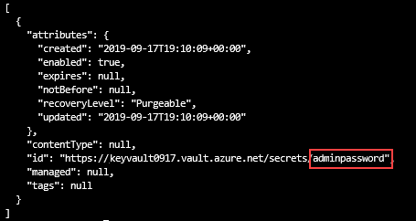

# Quickstart: Set and retrieve a secret from Azure Key Vault using an ARM template

[Azure Key Vault](../general/overview.md) is a cloud service that provides a secure store for secrets, such as keys, passwords, certificates, and other secrets. This quickstart focuses on the process of deploying an Azure Resource Manager template (ARM template) to create a key vault and a secret.

[!INCLUDE [About Azure Resource Manager](../../../includes/resource-manager-quickstart-introduction.md)]

If your environment meets the prerequisites and you're familiar with using ARM templates, select the **Deploy to Azure** button. The template will open in the Azure portal.

[](https://portal.azure.com/#create/Microsoft.Template/uri/https%3A%2F%2Fraw.githubusercontent.com%2FAzure%2Fazure-quickstart-templates%2Fmaster%2Fquickstarts%2Fmicrosoft.keyvault%2Fkey-vault-create%2Fazuredeploy.json)

## Prerequisites

To complete this article:

* If you don't have an Azure subscription, create a [free account](https://azure.microsoft.com/free/?WT.mc_id=A261C142F) before you begin.

* Your Azure AD user object ID is needed by the template to configure permissions. The following procedure gets the object ID (GUID).

    1. Run the following Azure PowerShell or Azure CLI command by select **Try it**, and then paste the script into the shell pane. To paste the script, right-click the shell, and then select **Paste**.

        # [CLI](#tab/CLI)
        ```azurecli-interactive
        echo "Enter your email address that is used to sign in to Azure:" &&
        read upn &&
        az ad user show --id $upn --query "objectId" &&
        echo "Press [ENTER] to continue ..."
        ```

        # [PowerShell](#tab/PowerShell)
        ```azurepowershell-interactive
        $upn = Read-Host -Prompt "Enter your email address used to sign in to Azure"
        (Get-AzADUser -UserPrincipalName $upn).Id
        Write-Host "Press [ENTER] to continue..."
        ```

        ---

    2. Write down the object ID. You need it in the next section of this quickstart.

## Review the template

The template used in this quickstart is from [Azure Quickstart Templates](https://azure.microsoft.com/resources/templates/101-key-vault-create/).

:::code language="json" source="~/quickstart-templates/quickstart/microsoft.keyvault/key-vault-create/azuredeploy.json":::

Two Azure resources are defined in the template:

* [**Microsoft.KeyVault/vaults**](/azure/templates/microsoft.keyvault/vaults): create an Azure key vault.
* [**Microsoft.KeyVault/vaults/secrets**](/azure/templates/microsoft.keyvault/vaults/secrets): create a key vault secret.

More Azure Key Vault template samples can be found in [Azure Quickstart Templates](https://azure.microsoft.com/resources/templates/?resourceType=Microsoft.Keyvault&pageNumber=1&sort=Popular).

## Deploy the template

1. Select the following image to sign in to Azure and open a template. The template creates a key vault and a secret.

    [](https://portal.azure.com/#create/Microsoft.Template/uri/https%3A%2F%2Fraw.githubusercontent.com%2FAzure%2Fazure-quickstart-templates%2Fmaster%2Fquickstarts%2Fmicrosoft.keyvault%2Fkey-vault-create%2Fazuredeploy.json)

2. Select or enter the following values.

    

    Unless it's specified, use the default value to create the key vault and a secret.

    * **Subscription**: select an Azure subscription.
    * **Resource group**: select **Create new**, enter a unique name for the resource group, and then click **OK**.
    * **Location**: select a location. For example, **Central US**.
    * **Key Vault Name**: enter a name for the key vault, which must be globally unique within the .vault.azure.net namespace. You need the name in the next section when you validate the deployment.
    * **Tenant Id**: the template function automatically retrieves your tenant ID. Don't change the default value.
    * **Ad User Id**: enter your Azure AD user object ID that you retrieved from [Prerequisites](#prerequisites).
    * **Secret Name**: enter a name for the secret that you store in the key vault. For example, **adminpassword**.
    * **Secret Value**: enter the secret value. If you store a password, it's recommended to use the generated password you created in Prerequisites.
    * **I agree to the terms and conditions state above**: Select.
3. Select **Purchase**. After the key vault has been deployed successfully, you get a notification:

    

The Azure portal is used to deploy the template. In addition to the Azure portal, you can also use the Azure PowerShell, Azure CLI, and REST API. To learn other deployment methods, see [Deploy templates](../../azure-resource-manager/templates/deploy-powershell.md).

## Review deployed resources

You can either use the Azure portal to check the key vault and the secret, or use the following Azure CLI or Azure PowerShell script to list the secret created.

# [CLI](#tab/CLI)

```azurecli-interactive
echo "Enter your key vault name:" &&
read keyVaultName &&
az keyvault secret list --vault-name $keyVaultName &&
echo "Press [ENTER] to continue ..."
```

# [PowerShell](#tab/PowerShell)

```azurepowershell-interactive
$keyVaultName = Read-Host -Prompt "Enter your key vault name"
Get-AzKeyVaultSecret -vaultName $keyVaultName
Write-Host "Press [ENTER] to continue..."
```

---

The output looks similar to:

# [CLI](#tab/CLI)



# [PowerShell](#tab/PowerShell)


---

## Clean up resources

Other Key Vault quickstarts and tutorials build upon this quickstart. If you plan to continue on to work with subsequent quickstarts and tutorials, you may wish to leave these resources in place.
When no longer needed, delete the resource group, which deletes the Key Vault and related resources. To delete the resource group by using Azure CLI or Azure PowerShell:

# [CLI](#tab/CLI)

```azurecli-interactive
echo "Enter the Resource Group name:" &&
read resourceGroupName &&
az group delete --name $resourceGroupName &&
echo "Press [ENTER] to continue ..."
```

# [PowerShell](#tab/PowerShell)

```azurepowershell-interactive
$resourceGroupName = Read-Host -Prompt "Enter the Resource Group name"
Remove-AzResourceGroup -Name $resourceGroupName
Write-Host "Press [ENTER] to continue..."
```

---

## Next steps

In this quickstart, you created a key vault and a secret using an ARM template, and validated the deployment. To learn more about Key Vault and Azure Resource Manager, continue on to the articles below.

- Read an [Overview of Azure Key Vault](../general/overview.md)
- Learn more about [Azure Resource Manager](../../azure-resource-manager/management/overview.md)
- Review the [Key Vault security overview](../general/security-features.md)
