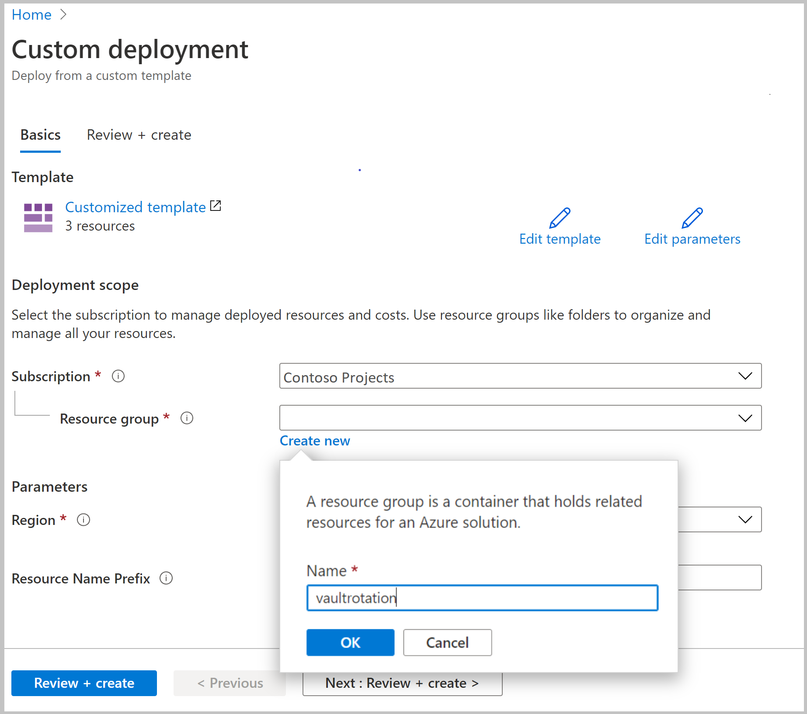
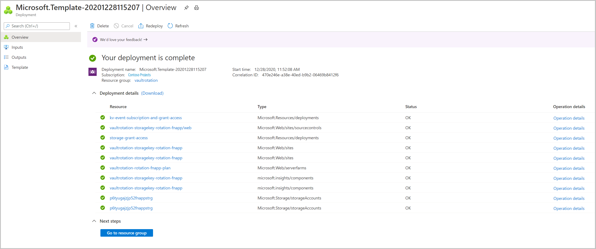
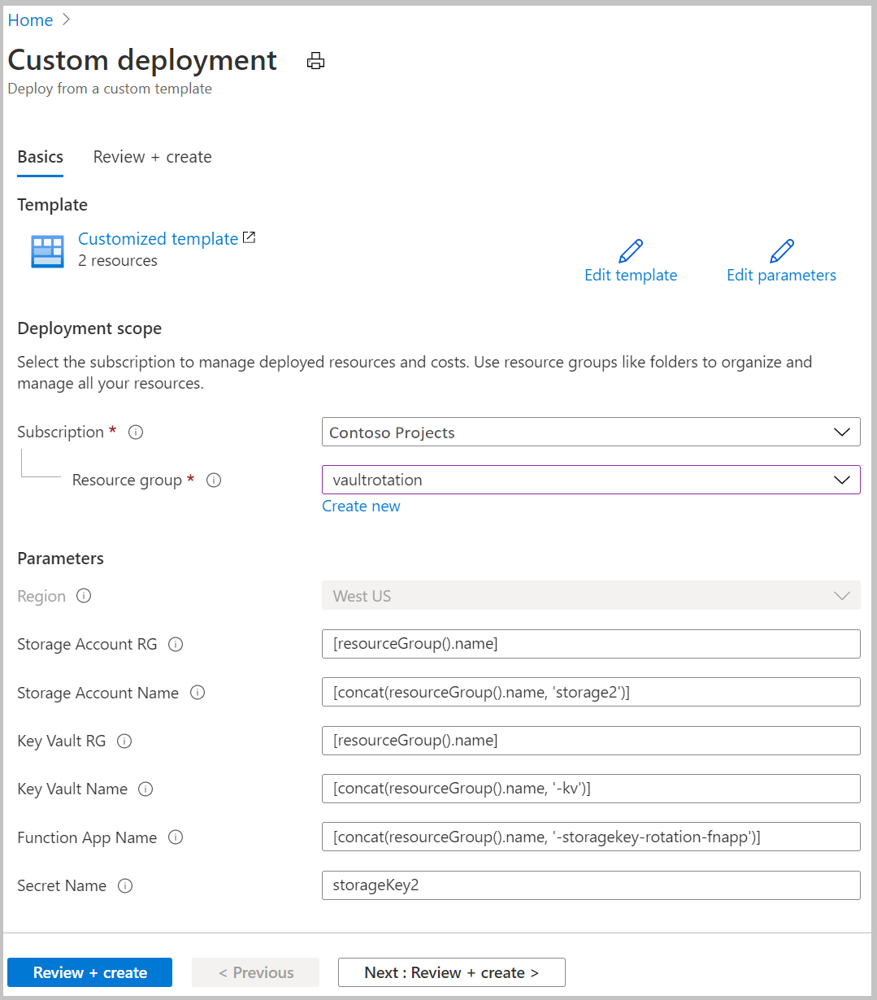

# Automate the rotation of a secret for resources that have two sets of authentication credentials

The best way to authenticate to Azure services is by using a [managed identity](../general/authentication.md), but there are some scenarios where that isn't an option. In those cases, access keys or passwords are used. You should rotate access keys and passwords frequently.

This tutorial shows how to automate the periodic rotation of secrets for databases and services that use two sets of authentication credentials. Specifically, this tutorial rotates Azure Storage account keys stored in Azure Key Vault as secrets by using a function triggered by Azure Event Grid notification. 

> [!NOTE]
> Storage account keys can be automatically managed in Key Vault if you provide shared access signature tokens for delegated access to the storage account. There are services that require storage account connection strings with access keys. For that scenario, we recommend this solution.

Here's the rotation solution described in this tutorial: 


In this solution, Azure Key Vault stores storage account individual access keys as versions of the same secret, alternating between the primary and secondary key in subsequent versions. When one access key is stored in the latest version of the secret, the alternate key is regenerated and added to Key Vault as the new latest version of the secret. The solution provides the application's entire rotation cycle to refresh to the newest regenerated key. 

1. Thirty days before the expiration date of a secret, Key Vault publishes the near expiry event to Event Grid.
1. Event Grid checks the event subscriptions and uses HTTP POST to call the function app endpoint that's subscribed to the event.
1. The function app identifies the alternate key (not the latest one) and calls the storage account to regenerate it.
1. The function app adds the new regenerated key to Azure Key Vault as the new version of the secret.

## Prerequisites
* An Azure subscription. [Create one for free.](https://azure.microsoft.com/free/?WT.mc_id=A261C142F)
* Azure Key Vault.
* Two Azure storage accounts.

You can use this deployment link if you don't have an existing key vault and existing storage accounts:

[](https://portal.azure.com/#create/Microsoft.Template/uri/https%3A%2F%2Fraw.githubusercontent.com%2Fjlichwa%2FKeyVault-Rotation-StorageAccountKey-PowerShell%2Fmaster%2Farm-templates%2FInitial-Setup%2Fazuredeploy.json)

1. Under **Resource group**, select **Create new**. Name the group **akvrotation** and then select **OK**.
1. Select **Review + create**.
1. Select **Create**.

    

You'll now have a key vault and two storage accounts. You can verify this setup in the Azure CLI by running this command:

```azurecli
az resource list -o table -g akvrotation
```

The result will look something this output:

```console
Name                     ResourceGroup         Location    Type                               Status
-----------------------  --------------------  ----------  ---------------------------------  --------
akvrotation-kv         akvrotation      eastus      Microsoft.KeyVault/vaults
akvrotationstorage     akvrotation      eastus      Microsoft.Storage/storageAccounts
akvrotationstorage2    akvrotation      eastus      Microsoft.Storage/storageAccounts
```

## Create and deploy the key rotation function

Next, you'll create a function app with a system-managed identity, in addition to other required components. You'll also deploy the rotation function for the storage account keys.

The function app rotation function requires the following components and configuration:
- An Azure App Service plan
- A storage account to manage function app triggers
- An access policy to access secrets in Key Vault
- Storage Account Key Operator Service role assigned to the function app so it can access storage account access keys
- Key rotation function with an event trigger and an HTTP trigger (on-demand rotation)
- An Event Grid event subscription for the **SecretNearExpiry** event

1. Select the Azure template deployment link: 

   [](https://portal.azure.com/#create/Microsoft.Template/uri/https%3A%2F%2Fraw.githubusercontent.com%2Fjlichwa%2FKeyVault-Rotation-StorageAccountKey-PowerShell%2Fmaster%2Farm-templates%2FFunction%2Fazuredeploy.json)

1. In the **Resource group** list, select **akvrotation**.
1. In the **Storage Account RG** box, enter the name of the resource group in which your storage account is located. Keep the default value **[resourceGroup().name]** if your storage account is already located in the same resource group where you'll deploy the key rotation function.
1. In the **Storage Account Name** box, enter the name of the storage account that contains the access keys to rotate.
1. In the **Key Vault RG** box, enter the name of resource group in which your key vault is located. Keep the default value **[resourceGroup().name]** if your key vault already exists in the same resource group where you'll deploy the key rotation function.
1. In the **Key Vault Name** box, enter the name of the key vault.
1. In the **Function App Name** box, enter the name of the function app.
1. In the **Secret Name** box, enter the name of the secret where access keys will be stored.
1. In the **Repo URL** box, enter the GitHub location of the function code: **https://github.com/jlichwa/KeyVault-Rotation-StorageAccountKey-PowerShell.git**.
1. Select **Review + create**.
1. Select **Create**.

   

After you complete the preceding steps, you'll have a storage account, a server farm, a function app, and Application Insights. When the deployment is complete, you'll see this page:
   
> [!NOTE]
> If you encounter a failure, you can select **Redeploy** to finish the deployment of the components.


You can find deployment templates and code for the rotation function on [GitHub](https://github.com/jlichwa/KeyVault-Rotation-StorageAccountKey-PowerShell).

## Add the storage account access keys to Key Vault

First, set your access policy to grant **manage secrets** permissions to users:

```azurecli
az keyvault set-policy --upn <email-address-of-user> --name akvrotation-kv --secret-permissions set delete get list
```

You can now create a new secret with a storage account access key as its value. You'll also need the storage account resource ID, secret validity period, and key ID to add to the secret so the rotation function can regenerate the key in the storage account.

Determine the storage account resource ID. You can find this value in the `id` property.
```azurecli
az storage account show -n akvrotationstorage
```

List the storage account access keys so you can get the key values:

```azurecli
az storage account keys list -n akvrotationstorage 
```

Run this command, using your retrieved values for `key1Value` and `storageAccountResourceId`:

```azurecli
$tomorrowDate = (get-date).AddDays(+1).ToString("yyy-MM-ddThh:mm:ssZ")
az keyvault secret set --name storageKey --vault-name akvrotation-kv --value <key1Value> --tags "CredentialId=key1" "ProviderAddress=<storageAccountResourceId>" "ValidityPeriodDays=60" --expires $tomorrowDate
```

If you create a secret with a short expiration date, a `SecretNearExpiry` event will publish within several minutes. This event will in turn trigger the function to rotate the secret.

You can verify that access keys are regenerated by retrieving and comparing Storage Account keys and Key Vault secret.

You can show secret information using below command:
```azurecli
az keyvault secret show --vault-name akvrotation-kv --name storageKey
```
Notice that `CredentialId` is updated to alternate `keyName` and `value` is regenerated


Retrieve access keys to validate value
```azurecli
az storage account keys list -n akvrotationstorage 
```


## Add additional Storage Accounts for rotation

Same function app can be reused to rotate multiple Storage Accounts. 

Adding additional storage account keys for rotation to existing function requires:
- Assign Storage Account Key Operator Service role to function app to access Storage Account access keys
- EventGrid event subscription for **SecretNearExpiry** event

1. Select the Azure template deployment link: 

   [](https://portal.azure.com/#create/Microsoft.Template/uri/https%3A%2F%2Fraw.githubusercontent.com%2Fjlichwa%2FKeyVault-Rotation-StorageAccountKey-PowerShell%2Fmaster%2Farm-templates%2FAdd-Event-Subscription%2Fazuredeploy.json)

1. In the **Resource group** list, select **akvrotation**.
1. In the **Storage Account Name**, type the storage account name with access keys to rotate
1. In the **Key Vault Name**,  type the key vault name
1. In the **Function App Name**,  type the function app name
1. In the **Secret Name**,  type secret name where access keys would be stored
1. Select **Review+Create**.
1. Select **Create**

   

### Add Another Storage Account access key to Key Vault

Retrieve Storage Account resource ID. Value can be found under `id` property
```azurecli
az storage account show -n akvrotationstorage2
```

List the Storage Account access keys to retrieve key2 value

```azurecli
az storage account keys list -n akvrotationstorage2 
```

Populate retrieved values for **key2Value** and **storageAccountResourceId**

```azurecli
tomorrowDate=`date -d tomorrow -Iseconds -u | awk -F'+' '{print $1"Z"}'`
az keyvault secret set --name storageKey2 --vault-name akvrotation-kv --value <key2Value> --tags "CredentialId=key2" "ProviderAddress=<storageAccountResourceId>" "ValidityPeriodDays=60" --expires $tomorrowDate
```

Show secret information using below command:
```azurecli
az keyvault secret show --vault-name akvrotation-kv --name storageKey2
```
Notice that `CredentialId` is updated to alternate `keyName` and `value` is regenerated


Retrieve access keys to validate value
```azurecli
az storage account keys list -n akvrotationstorage 
```


## Available Key Vault dual credential rotation functions

- [Storage Account](https://github.com/jlichwa/KeyVault-Rotation-StorageAccountKey-PowerShell)
- [Redis Cache](https://github.com/jlichwa/KeyVault-Rotation-RedisCacheKey-PowerShell)

## Learn more
- Overview: [Monitoring Key Vault with Azure Event Grid](../general/event-grid-overview.md)
- How to: [Create your first function in the Azure portal](../../azure-functions/functions-create-first-azure-function.md)
- How to: [Receive email when a key vault secret changes](../general/event-grid-logicapps.md)
- [Azure Event Grid event schema for Azure Key Vault](../../event-grid/event-schema-key-vault.md)
